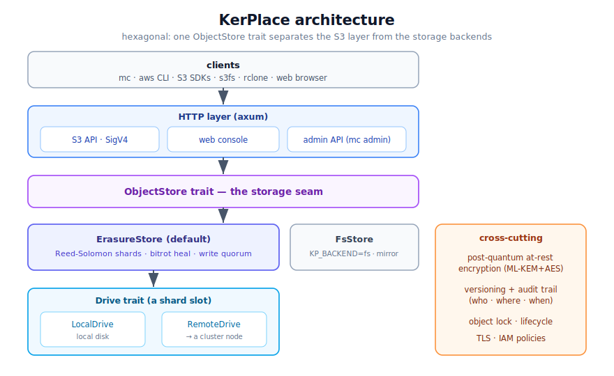
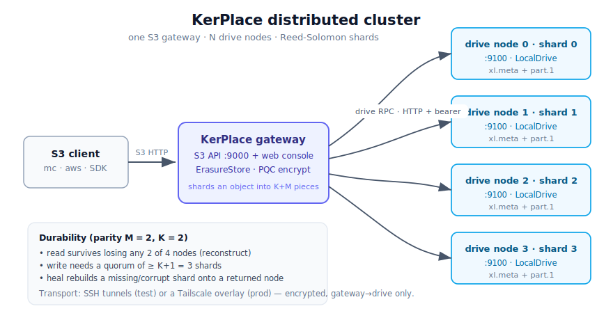

# KerPlace

**An S3-compatible object storage server in Rust** — with **post-quantum encryption at
rest** and **off-host key custody**. A self-hostable, sovereign alternative to MinIO.

[](https://github.com/agalletero/kerplace/actions/workflows/ci.yml)
[](LICENSE)
[](https://github.com/agalletero/kerplace/releases/latest)
[](https://github.com/sponsors/agalletero)

🌐 **[www.kerplace.com](https://www.kerplace.com)** &nbsp;·&nbsp; 📦 **[Download latest →](https://github.com/agalletero/kerplace/releases/latest)** &nbsp;·&nbsp; 💜 **[Sponsor the project →](https://github.com/sponsors/agalletero)**

> **Status: v0.1 — honest about its limits.** The S3 data plane, post-quantum
> at-rest encryption, erasure coding and the distributed cluster are working and
> validated against `mc` / `aws` / `s3fs` / `rclone`. **Off-host key custody
> (HYOK)** — your keys stay on a USB/laptop and reach the server over a
> post-quantum SSH tunnel, so the host seals and can no longer decrypt the moment
> the key leaves — is shipped and validated on live deployments. A web console,
> OIDC single sign-on and a MinIO migration tool ship today too. Gateway
> high-availability, LDAP, storage tiering and cross-site replication are 🗓️
> planned, **not shipped**. KerPlace publishes its limits rather than hiding them
> — see [Status](#status), the [security model](docs/SECURITY_MODEL.md), and
> [SECURITY.md](SECURITY.md) for reporting issues.

---



## Features

- **S3-compatible API** (path-style) — works with `mc`, `aws s3`, and S3 SDKs:
  - Buckets: create / list / delete / head
  - Objects: PUT / GET / HEAD / DELETE, nested keys, content types, user metadata
  - **Multipart upload** (large files), **Range** reads, server-side copy
  - `ListObjectsV2` with prefix/delimiter, batch delete
- **AWS Signature V4** auth (header + **presigned URLs**) and `aws-chunked` streaming
- **Web console** (embedded, no build step) on its own port: manage buckets and
  browse/upload/download/delete objects from the browser
- **Streaming I/O** — large objects are never buffered in memory
- Clean **hexagonal architecture**: a single `ObjectStore` trait is the seam, so
  new storage backends can be added without touching the HTTP layer

## Install

**Prebuilt binary (recommended).** Each release ships a **fully-static** Linux
binary (musl, no glibc) that runs on any `x86_64` Linux — including old distros.
Download it from the [Releases](../../releases) page:

```bash
curl -LO <release-url>/kerplace-vX.Y.Z-x86_64-linux-musl
chmod +x kerplace-vX.Y.Z-x86_64-linux-musl
./kerplace-vX.Y.Z-x86_64-linux-musl --version
```

**From source:**

```bash
cargo build --release                 # ./target/release/kerplace
./build-static.sh                     # or: a static musl binary in ./dist/
```

`kerplace --help` lists the flags and the main `KP_*` environment variables;
`kerplace --version` prints the version.

## Quick start

```bash
# KerPlace-native: configured via KP_* env vars
KP_DATA_DIR=./data ./kerplace

# ...or the MinIO-compatible form (drop-in for existing launch commands):
./kerplace server --address :9000 --console-address :9001 /data
```

> **Migrating from MinIO?** `kerplace server --address … --console-address … <paths>`
> mirrors `minio server …` (one path = data dir, several = erasure drives), and
> `MINIO_ROOT_USER` / `MINIO_ROOT_PASSWORD` are honoured as fallbacks — so
> existing service files and credentials keep working. To move buckets, objects,
> versions, users and per-bucket config across, use the bundled
> **[`kerplace-migrate.sh`](kerplace-migrate.sh)** tool — see the full
> **[Migration guide](docs/MIGRATION.md)**.

Then either open the **console** at <http://localhost:9001> (default login
`minioadmin` / `minioadmin`), or use a CLI:

```bash
# MinIO client
mc alias set local http://localhost:9000 minioadmin minioadmin
mc mb local/my-bucket
mc cp ./somefile local/my-bucket/

# AWS CLI
aws --endpoint-url http://localhost:9000 s3 mb s3://my-bucket
aws --endpoint-url http://localhost:9000 s3 cp ./somefile s3://my-bucket/
```

## Configuration

All configuration is via environment variables (MinIO-compatible defaults):

| Variable | Default | Description |
|---|---|---|
| `KP_ADDRESS` | `0.0.0.0:9000` | S3 API listen address |
| `KP_CONSOLE_ADDRESS` | `0.0.0.0:9001` | Web console listen address |
| `KP_CONSOLE` | `true` | Set `false` to disable the console |
| `KP_DATA_DIR` | `./data` | Where buckets/objects are stored |
| `KP_ROOT_USER` | `minioadmin` | Access key |
| `KP_ROOT_PASSWORD` | `minioadmin` | Secret key |
| `KP_REGION` | `us-east-1` | Region in the SigV4 scope |
| `KP_AUTH` | `true` | Set `false` to disable S3 auth (dev only) |
| `KP_DEBUG` | — | Log level for support: `debug` / `trace` / `info` / `warn` / `error` (or a truthy value → `debug`). At `debug`, every request is logged. `RUST_LOG` overrides it. |
| `KP_ENCRYPT` | `false` | Set `true` to encrypt all objects at rest (AES-256-GCM) |
| `KP_TLS` | `false` | Set `true` to serve over HTTPS with a self-signed dev cert |
| `KP_TLS_CERT` | — | Path to a PEM certificate chain (enables TLS; overrides self-signed) |
| `KP_TLS_KEY` | — | Path to the PEM private key paired with `KP_TLS_CERT` |
| `KP_USERS` | — | Seed IAM users: `accessKey:secretKey:policy` entries, comma-separated. Policies: `readwrite`, `readonly`, `writeonly`, `admin` |
| `KP_BACKEND` | `erasure` | Storage backend: `erasure` (default) or `fs` (legacy single-disk mirror) |
| `KP_ERASURE_DRIVES` | 4 sub-dirs | Comma-separated local drive dirs for the erasure backend |
| `KP_ERASURE_PARITY` | `N/2` | Parity shards `M` (survive losing `M` drives/nodes) |
| `KP_ROLE` | `gateway` | `drive` runs this node as a storage node (internal RPC only); else it's an S3 gateway |
| `KP_DRIVE_ADDR` | `0.0.0.0:9100` | Bind address of the internal drive RPC (drive mode) |
| `KP_NODES` | — | Distributed gateway: `idx=addr` shard-slot map, comma-separated (e.g. `0=10.0.0.1:9100,1=10.0.0.2:9100`) |
| `KP_NODE_INDEX` | — | Which shard slot **this** machine hosts locally (the rest are remote) |
| `KP_CLUSTER_SECRET` | — | Shared bearer secret authenticating the internal drive RPC |
| `KP_CLUSTER_LOCKS` | `false` | `true` enables distributed quorum object locks (for running several gateways against one cluster; local locking is always on) |
| `KP_MINIO_COMPAT` | `true` | Also serve the admin/health API under the MinIO-compatible `/minio/*` prefix (alias of the canonical `/kerplace/*`), so `mc admin` works unchanged. Set `false` once all tooling is KerPlace-native |

## Web console

The console is a single embedded page (served by the server itself, no Node
required). Log in with your access/secret key, then:

- Create and delete buckets (with a "delete non-empty bucket" option)
- Browse objects as folders (key prefixes); upload (multi-file), download, delete
- Per-bucket settings: versioning (enable/suspend) and encryption (enable/disable)
- Object version viewer (download/delete a specific version or delete marker)
- Users & Access: add users with a policy, enable/disable, delete
- Capability badges (post-quantum encryption, TLS, auth, versioning)

## Mounting buckets as a filesystem (`kerplace.sh`)

`kerplace.sh` mounts buckets locally via [s3fs-fuse](https://github.com/s3fs-fuse/s3fs-fuse)
and inspects server state. Configure it with `KP_URL` / `KP_ACCESS_KEY` /
`KP_SECRET_KEY` / `KP_MOUNT_BASE` (env vars), then:

```bash
./kerplace.sh show-mount      # dashboard: buckets, encryption, versioning, users, mounts
./kerplace.sh mount-all       # mount every bucket under $KP_MOUNT_BASE (default /mnt/datalake)
./kerplace.sh umount-all      # unmount them
./kerplace.sh mount <bucket>  # mount/unmount a single bucket
```

It uses path-style addressing + SigV4, so it talks to KerPlace exactly as the
legacy MinIO mount scripts did. Requires `mc` and `s3fs` on the host.

> Coming from MinIO and want a *filesystem view* of your data — or wondering
> whether `KP_BACKEND=fs` is "filesystem mode"? It isn't. See
> **[docs/LEGACY_ACCESS.md](docs/LEGACY_ACCESS.md)** for the supported path
> (s3fs over S3) and what the legacy `fs` backend actually is.

## Clustering

KerPlace runs as a zero-config single host (erasure-coded by default), or as a
**distributed cluster** whose shards live on separate machines — a gateway plus
N drive nodes, surviving the loss of whole nodes.



```bash
# a drive node (stores one shard slot, internal RPC only)
KP_ROLE=drive KP_DRIVE_ADDR=0.0.0.0:9100 KP_CLUSTER_SECRET=$S ./kerplace

# the gateway (serves S3, shards across the nodes)
KP_NODES="0=local,1=node1:9100,2=node2:9100,3=node3:9100" KP_NODE_INDEX=0 \
KP_ERASURE_PARITY=2 KP_CLUSTER_SECRET=$S ./kerplace
```

See **[docs/CLUSTERING.md](docs/CLUSTERING.md)** for deployment modes, the
erasure model, SSH-tunnel vs Tailscale connectivity, and operating/heal commands;
and **[docs/PRODUCTION_TAILSCALE.md](docs/PRODUCTION_TAILSCALE.md)** for the
hardened production runbook over a Tailscale overlay (with `cluster-node.sh`).

## Migrating from MinIO

MinIO's community edition was stripped back. Because KerPlace speaks the same S3 + admin API, the bundled
**[`kerplace-migrate.sh`](kerplace-migrate.sh)** tool migrates a running MinIO into
KerPlace over the network — buckets, objects, version history, IAM users/policies
and per-bucket config — without touching either server's disks, and with the
source staying online until you cut over:

```bash
mc alias set oldminio https://minio.example.com:9000 ACCESS SECRET
mc alias set kerplace    http://localhost:9000          minioadmin minioadmin

./kerplace-migrate.sh oldminio kerplace all --dry-run   # preview, no changes
./kerplace-migrate.sh oldminio kerplace all             # migrate (add --with-versions for full history)
```

See the **[Migration guide](docs/MIGRATION.md)** for the phase-by-phase
breakdown, the secret-key rotation caveat, and a safe cutover procedure; and
**[docs/LEGACY_ACCESS.md](docs/LEGACY_ACCESS.md)** for mapping your old MinIO
*access patterns* (filesystem mounts, FS mode) onto KerPlace.

## Tests

```bash
cargo test
```

Covers the filesystem backend, SigV4 (including the AWS documented vectors and
presigned URLs), and the HTTP layer end-to-end.

## Troubleshooting

Hitting an issue? Restart with debug logging and capture the output:

```bash
KP_DEBUG=debug ./kerplace > kerplace.log 2>&1
# reproduce the problem, then send kerplace.log
```

`KP_DEBUG=debug` logs every request (method, path, status, latency); `trace`
is more verbose still. It's off by default, so normal runs stay quiet.

## Status

Working & validated with `mc` / `aws` / `s3fs` / `rclone` / `curl`:

- Core S3: buckets, objects (nested keys, spaces), ListObjectsV2, multipart,
  range, server-side copy, batch delete, POST form upload.
- Auth: SigV4 (header + `aws-chunked` + presigned), multi-user IAM with canned
  policies, `mc admin user` (madmin-compatible). **OIDC SSO** (`KP_OIDC_ISSUER`):
  console login via your IdP (Keycloak/Entra/Okta) + STS
  `AssumeRoleWithWebIdentity` for temporary S3 credentials, with group→policy
  mapping. See the **[Security model](docs/SECURITY_MODEL.md)**.
- At-rest encryption: **ML-KEM-1024 (post-quantum) + AES-256-GCM**, per-bucket SSE.
  Envelope encryption with a pluggable key-custody seam (`KP_KEY_PROVIDER`):
  `file` (default; on-host key), **`passphrase`** (Argon2id-derived KEK, never on
  disk — `KP_KEY_PASSPHRASE`), or **`kms`** (external HashiCorp Vault Transit;
  wrap/unwrap are KMS calls, fail-closed — `KP_KMS_ENDPOINT`/`KP_KMS_KEY`/
  `KP_KMS_TOKEN`). The server reports its custody posture honestly at startup, in
  `info`, and in the console. See the **[Security model](docs/SECURITY_MODEL.md)**
  — and **[Off-host key custody](docs/OFFHOST_KMS_CUSTODY.md)** for the powerful
  "your data on their host, your keys on your laptop" deployment (a host compromise
  yields only ciphertext).
- Versioning (real), object lock (retention + legal hold), lifecycle/ILM expiry.
- **Erasure coding (default backend):** Reed-Solomon shards across drives with
  BLAKE3 bitrot detection — survives drive losses, opaque format. Multipart +
  versioning + streaming reconstruction. `KP_BACKEND=fs` for the legacy mirror.
- **Self-healing:** `POST /kerplace/admin/v3/heal` (`?bucket=&dryRun=`) detects and
  rewrites missing/corrupt shards back to full redundancy; `mc admin info`
  reports the erasure profile and per-drive state.
- **Audit versioning (differentiator):** every version write records **who**
  (access key), **where** (client IP) and **when**. Surfaced compat-safely as
  the standard S3 `<Owner>` in `ListObjectVersions` and `x-kerplace-author` /
  `x-kerplace-source-ip` headers on GET/HEAD — no standard S3 response is changed.
- TLS/HTTPS, web console, and `s3fs` mount compatibility.
- **Deployment profiles** (`KP_PROFILE=open|sealed`): `sealed` is a one-word
  regulated posture — the server refuses to start unless TLS + auth + at-rest
  encryption + the erasure backend + a reachable OIDC IdP + **off-host** key
  custody (`passphrase`/`kms`, not `file`) are all in place.

🗓️ **Not yet implemented** (planned, not shipped — stated plainly so nothing is
over-promised): **gateway high-availability** (durability ≠ availability — the S3
plane runs on a single gateway today; the cluster survives node loss for *data*,
not for the gateway), CORS, ListObjects v1, S3 Select, bucket notifications /
cross-site replication, LDAP/AD, service accounts, storage tiering, and the rest
of the MinIO admin API (config).

## Roadmap

**Shipped since the first prototype:** ✅ distributed multi-node erasure (drives
across nodes, quorum, self-heal) · ✅ external KMS key wrapping (HashiCorp Vault
Transit) · ✅ OIDC SSO + STS `AssumeRoleWithWebIdentity` · ✅ `KP_PROFILE=sealed`
regulated, fail-closed posture.

🗓️ **Planned next:**

1. Gateway high-availability (remove the single-gateway availability SPOF).
2. CORS, ListObjects v1, and broader admin-API coverage.
3. LDAP/AD identity, service accounts, storage tiering, cross-site replication.

## Performance

KerPlace is honest about where its performance goes: the gateway concentrates all
crypto + erasure compute, so a single gateway is the throughput ceiling (durability
scales with drives, throughput doesn't until symmetric nodes). See
**[docs/PERFORMANCE.md](docs/PERFORMANCE.md)** for the bottleneck analysis, the
measure-first plan, and the optimization roadmap.

## Security

New to the cryptography? **[docs/POST_QUANTUM.md](docs/POST_QUANTUM.md)** explains,
in plain language, what post-quantum encryption is and why KerPlace uses it. To
report a vulnerability, see **[SECURITY.md](SECURITY.md)** (please disclose privately
first). For the design-level threat model and KerPlace's *declared* limits, see
**[docs/SECURITY_MODEL.md](docs/SECURITY_MODEL.md)**.

## Documentation

| Guide | What it covers |
|---|---|
| [docs/POST_QUANTUM.md](docs/POST_QUANTUM.md) | What post-quantum encryption is and why it matters (plain language) |
| [docs/ENCRYPTION.md](docs/ENCRYPTION.md) | At-rest encryption: on by default, transparent, the triggers, the algorithm per provider |
| [docs/GLOSSARY.md](docs/GLOSSARY.md) | Every term — S3, bucket, KMS, KEK, DEK, Vault, FUSE, rclone, mc, alias… |
| [docs/SECURITY_MODEL.md](docs/SECURITY_MODEL.md) | Honest threat model: what KerPlace does and does **not** protect |
| [docs/OFFHOST_KMS_CUSTODY.md](docs/OFFHOST_KMS_CUSTODY.md) | The "your data on their host, your keys on your device" deployment |
| [docs/MIGRATION.md](docs/MIGRATION.md) | Migrating from MinIO to KerPlace |
| [docs/LEGACY_ACCESS.md](docs/LEGACY_ACCESS.md) | Filesystem (FUSE) access, mounting buckets, coming from MinIO |
| [WORKING_WITH_IT.md](WORKING_WITH_IT.md) | Day-to-day: aliases, buckets, encryption, SDKs |
| [INSTALL.md](INSTALL.md) | Build, configure, run, systemd |
| [docs/PERFORMANCE.md](docs/PERFORMANCE.md) | Bottleneck analysis and the optimization roadmap |

Questions not answered by the docs? **support@kerplace.com**.

## License

[Apache-2.0](LICENSE) — permissive and OSI-approved; the full license text is in
the [`LICENSE`](LICENSE) file.
