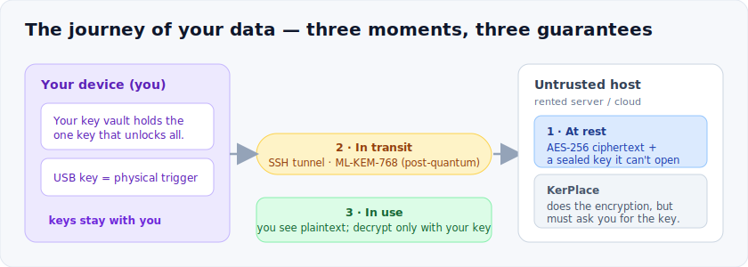
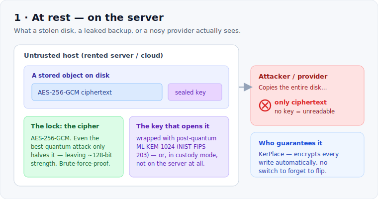
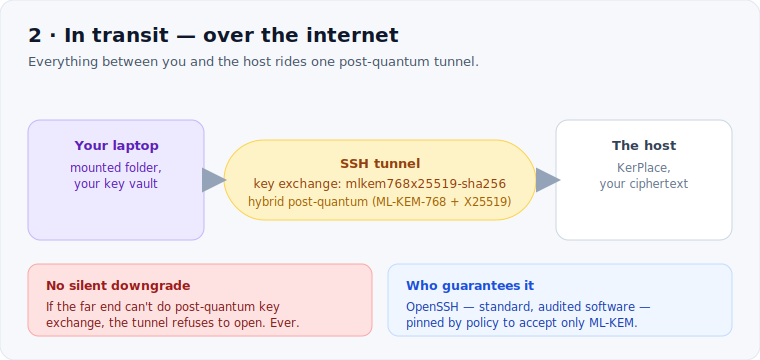
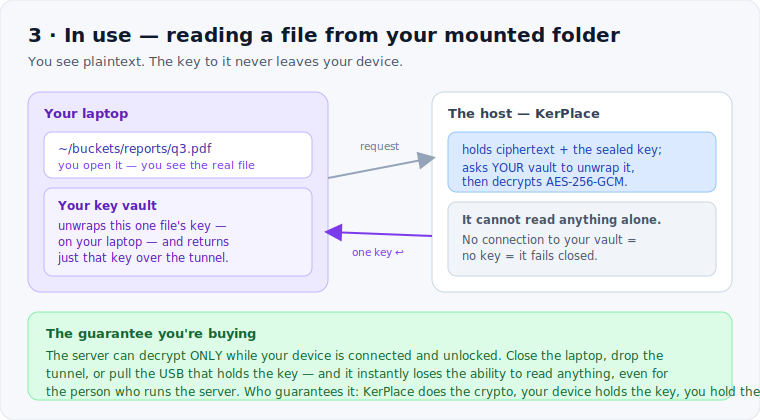

# Who protects your data — and when

*A plain-language guide to how KerPlace keeps your data encrypted, written for the
people who **choose** the solution — not only the engineers who run it. No
cryptography degree required.*

Your data lives through three moments where it could be exposed: **sitting on the
server** (at rest), **crossing the network** (in transit), and **while you actually
work with it** (in use). For each moment there is exactly one thing that guarantees
it stays protected. This page names it.

**At a glance:**

| Moment | What could leak | What protects it | Who guarantees it | Quantum-safe? |
|---|---|---|---|---|
| **At rest** — on the server's disk | your stored files | AES-256-GCM + a post-quantum-wrapped (or off-server) key | **KerPlace**, automatically on every write | Yes |
| **In transit** — over the internet | data moving to and from you | an SSH tunnel with a **post-quantum key exchange** | **OpenSSH**, pinned by policy | Yes — ML-KEM-768 |
| **In use** — your mounted folder | the plaintext you see | server-side decryption only *your* key vault can unlock | **KerPlace + your device** | Key never leaves you |

---

## 1 · At rest — who guarantees post-quantum encryption?

KerPlace encrypts an object **the moment it is written** — you don't switch anything
on; it is the default. Two things have to be safe, and both are.

**The lock — the cipher.** Every object is sealed with **AES-256-GCM**. Symmetric
ciphers like AES are the part of cryptography quantum computers barely dent: the best
known quantum attack (Grover's algorithm) only *halves* the effective strength,
leaving AES-256 at about 128-bit security — the level the industry treats as safe for
the foreseeable future. A stolen disk is brute-force-proof, quantum or not.

**The key — how the key to that lock is protected.** This is where classical systems
are actually vulnerable. The keys that guard your data are usually themselves
protected by *asymmetric* cryptography (RSA, elliptic curve) — and that is exactly
what a quantum computer breaks (Shor's algorithm). Attackers already **"harvest now,
decrypt later"**: they copy encrypted data today to unlock it once quantum hardware
arrives. KerPlace closes that door — the data key is wrapped with **ML-KEM-1024**, a
post-quantum algorithm standardised by NIST (FIPS 203). A quantum computer that
copies your disk still cannot unwrap it.

> **Who guarantees it:** KerPlace itself, server-side, on every write.

**In the strongest deployment, the key isn't even there.** In the *custody* setup
(section 3) the key that unwraps your data never lives on the server at all — it
stays on your own device. The server holds only ciphertext and a sealed key it
cannot open by itself.

---

## 2 · In transit — who guarantees the channel, and of what type?

When data moves between your device and the host, it travels inside a single **SSH
tunnel**, pinned *by policy* to a **post-quantum key exchange**:
`mlkem768x25519-sha256`. That is a **hybrid** — it combines **ML-KEM-768** (the
post-quantum part, NIST FIPS 203) with X25519 (the proven classical part), so the
connection stays safe even if either one were ever weakened. Inside that handshake,
the bytes themselves are protected with AES-256 / ChaCha20 — again, quantum-resistant.

"By policy" is the important part: the tunnel is configured to **refuse** any
connection that cannot offer post-quantum key exchange. It never silently falls back
to a weaker, breakable handshake. If the far end can't do post-quantum, the tunnel
simply doesn't come up — nothing is served in the clear.

> **Who guarantees it:** OpenSSH — standard, audited software — configured to accept
> **only** post-quantum key exchange. Type: **hybrid post-quantum (ML-KEM-768 + X25519)**.

---

## 3 · In use — once the drive is mounted on my laptop, who encrypts/decrypts, and how?

Day to day you mount your storage as an ordinary folder (via FUSE / s3fs). You open,
edit and save files as if they were local — you see **plaintext**. So where does the
encryption happen, and who holds the key?

- **The encryption and decryption happen on the server**, transparently — KerPlace
  does the AES-256-GCM work.
- **But the server cannot do it alone.** To unlock any file it must ask **your own
  key vault, running on your laptop**, to unwrap that file's key. The request travels
  over the post-quantum tunnel; the unwrapping key **never leaves your device**.

Reading a file, step by step:

1. You open `~/buckets/reports/q3.pdf` in your file manager.
2. s3fs turns that into a request over the tunnel to KerPlace on the host.
3. KerPlace fetches the object — ciphertext plus its sealed key — and asks **your**
   vault to unwrap the key.
4. Your vault unwraps it *on your laptop* and returns just that one key over the tunnel.
5. KerPlace decrypts the object and streams the plaintext back to you.

Writing is the same in reverse: your vault mints a fresh key, KerPlace encrypts, and
only ciphertext is ever stored on the host.

> **The guarantee you're really buying:** the server can decrypt **only while your
> device is connected and unlocked**. Close the laptop, drop the tunnel, or *remove
> the USB that holds the key*, and it instantly loses the ability to read anything —
> even for the person who runs the server. It fails **closed**: no key, no access.
>
> **Who guarantees it:** KerPlace does the cryptography; **your device holds the key**
> and releases it only over the post-quantum tunnel; **you** hold the device (and the
> USB). Three parties — and two of them are you.

---

## What this means when you're choosing

- **You do not trust the hosting provider with your data** — only with encrypted
  blobs they cannot read.
- **You do not trust the network** — the channel is post-quantum by policy, or it
  does not open.
- **You do not even trust the server with the keys** — they live with you, and you
  can cut access in a single gesture.

The building blocks are standard and auditable — **AES-256-GCM**, **ML-KEM** (NIST
FIPS 203), **OpenSSH**, and an open-source key vault. What KerPlace arranges is *who
holds what, and when* — so that the honest answer to *"who could read my data?"* is,
simply: **you**.

---

*Questions from a security or procurement team? Email **support@kerplace.com**.*
