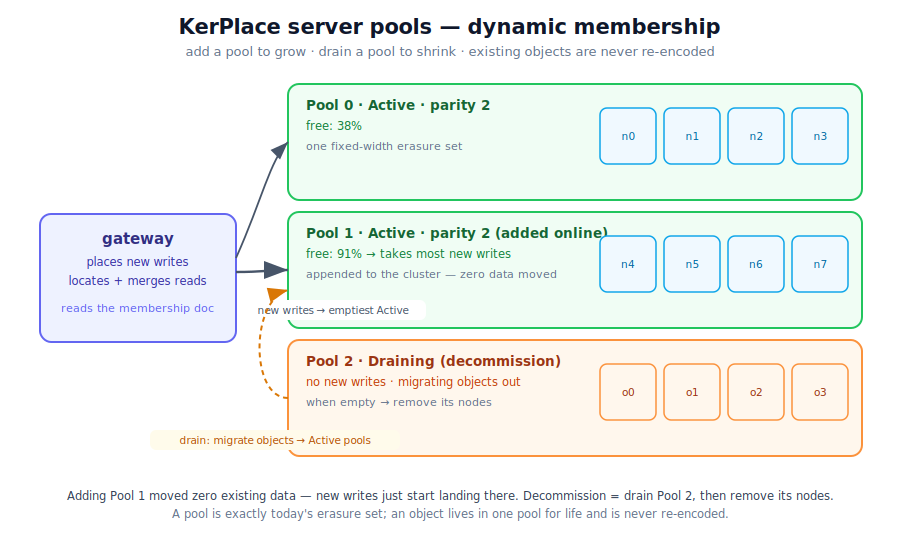

# Dynamic membership & rebalance — design

The last open Phase 4c item: change a running cluster's membership (add / remove
nodes) and rebalance data — **online**, without downtime or re-encoding the
world. This doc picks the model and lays out the phasing. For the existing
distributed design see [DISTRIBUTED_DESIGN.md](DISTRIBUTED_DESIGN.md).



## The problem

Today the gateway is configured with a **fixed** set of `N` drive nodes at boot
(`KP_NODES`). The `ErasureStore` is *one* erasure set: each object is
Reed-Solomon sharded into `K` data + `M` parity = `N` pieces, **one shard per
drive, positionally** (`drive i` ⇒ `shard i`), and metadata is replicated to all
`N` drives.

The `(K, M, N)` geometry is baked into every object's on-disk layout. So you
**cannot** just append a drive and change `N` — every existing object would have
to be re-encoded into the new width. That's an `O(total data)` migration on every
topology change: prohibitively expensive and risky to do online.

## The fork: how to change membership

| Model | Idea | Verdict |
|---|---|---|
| **A — grow/shrink the erasure set in place** | change `N`, re-encode every object into the new width | ❌ `O(all data)` migration per change; complex; risky online |
| **B — server pools** (à la MinIO) | the cluster is a *list of pools*; each pool is a fixed-width erasure set; membership changes add/drain whole pools; objects stay in their pool | ✅ no re-encoding ever; migration cost bounded to what actually moves |

**Decision: server pools (Model B).** It matches MinIO's mental model (familiar
to the license refugees we target), bounds migration cost, and composes with the
erasure engine we already have — **a pool is exactly today's `ErasureStore` drive
set**. Growing capacity = add a pool; shrinking = decommission (drain) a pool.

## The pool model

```
Pool { id, drives: Vec<Arc<dyn Drive>>, parity }     // one fixed-width erasure set
ErasureStore { pools: Vec<Pool>, crypto, locks, block_size }
```

A single pool is byte-for-byte today's behaviour. The cluster's authoritative
topology is a **membership document**:

```jsonc
{
  "epoch": 7,                       // monotonic; highest wins (like history.json)
  "pools": [
    { "id": 0, "parity": 2, "state": "Active",   "nodes": ["local","n1:9100","n2:9100","n3:9100"] },
    { "id": 1, "parity": 2, "state": "Active",   "nodes": ["n4:9100","n5:9100","n6:9100","n7:9100"] },
    { "id": 2, "parity": 2, "state": "Draining", "nodes": ["old1:9100","old2:9100","old3:9100","old4:9100"] }
  ]
}
```

Persisted and **replicated to every drive in every pool** (reusing the existing
epoch'd config-sidecar mechanism, widened across pools). The gateway builds its
`pools` from it at boot and re-reads it when it changes.

## Placement, locate, listing

- **Write placement** — a *new* object/version goes to the **Active** pool with
  the most free space (fill the emptiest); deterministic hash tie-break for
  reproducibility. A `Draining` pool never receives new writes.
- **Locate** (read / head / delete) — an object can live in any pool. Find the
  owning pool by a cheap `xl.meta` stat across pools; the pool that has it
  answers. (Optimization later: a placement hint to skip the scan.)
- **Listing** — merge across pools. `walk_union` already merges across the drives
  *within* a pool; the store merges those per-pool listings, de-duplicating by
  key. An object lives in exactly one pool, so versions don't normally split.
- **Bucket-level metadata** (existence, versioning, encryption, lifecycle) is
  **cluster-wide**: replicate to all drives in all pools and read fail-safe /
  most-protective across pools — exactly today's logic, widened from one pool to
  all.
- **Locks** — the resource key `<bucket>/<key>` is pool-independent, so the
  existing `LockSet` (local + optional fenced quorum) is unchanged. (Open detail:
  the quorum node set when membership changes — see Risks.)

## Online operations

- **Add a pool** — append an `Active` pool to the membership doc (admin op),
  replicate it; gateways pick it up and steer new writes to it (it's emptiest).
  **Zero data movement** — existing objects stay where they are.
- **Decommission a pool** — mark it `Draining` (stops new writes), then a
  background **drain** migrates every object out to other Active pools; when
  empty, mark `Decommissioned` and the operator removes the nodes.
- **Rebalance** — optional throttled background job that moves objects from
  over-full to under-full Active pools to equalize utilization.

Both drain and rebalance use one **migrate primitive**:

```
migrate_object(bucket, key, from_pool → to_pool):
  under the object lock, copy every version oldest→newest (reuse the
  version-replay path), verify, then delete from the source pool.
  Idempotent + resumable (re-running skips already-migrated objects); throttled.
```

## Admin surface

- `GET  /minio/admin/v3/pools` — list pools + state + utilization (read-only).
- `POST /minio/admin/v3/pools/add` — append a pool.
- `POST /minio/admin/v3/pools/decommission?pool=` — start a drain.
- `GET  /minio/admin/v3/pools/status` — drain / rebalance progress.

Where practical, map these onto the closest `mc admin` calls (MinIO has
`mc admin decommission`) so the tooling feels native — a goal, not a phase-1 gate.

## Phasing

| Milestone | Scope | Risk |
|---|---|---|
| **4c-m1** | Extract a `Pool` struct; `ErasureStore { pools }` holds **one** pool — behavior-preserving (all 98 tests green). Read-only `GET /minio/admin/v3/pools`. | the 86-site `self.drives` refactor; mechanical, tests are the safety net |
| **4c-m2** | Persisted + replicated **membership document** (epoch'd); the gateway builds pools from it. Topology becomes data-driven. | medium |
| **4c-m3** | Multi-pool **placement + locate + listing merge**. Adding a pool now actually spreads new writes. | high — the heart |
| **4c-m4** | Online **add-pool** + the **migrate primitive** + **decommission/drain** + **rebalance**, with progress reporting. | high |

## Risks / open details

- **Locate cost** — a stat across pools on each read. Fine for a handful of
  pools; add a placement hint / small cache if it bites.
- **Cross-pool bucket-config consistency** — must replicate to all pools; reuse
  the epoch'd sidecar mechanism, widened.
- **Lock quorum under membership change** — the quorum node set shifts when pools
  are added/removed; the fenced quorum lock assumes a stable membership. Re-derive
  the quorum (or pin a lock-quorum sub-set) on a membership change — a 4c-m4 item.
- **Exactly-one-pool invariant** — placement and locate must agree that an object
  lives in one pool; the locate-by-stat scan is the correctness safety net even if
  a placement hint is wrong.
- **Drain crash-safety** — migrate per object under its lock, delete-from-source
  only after the target write verifies; a crash mid-drain just leaves the object
  in the source pool (re-run resumes).
