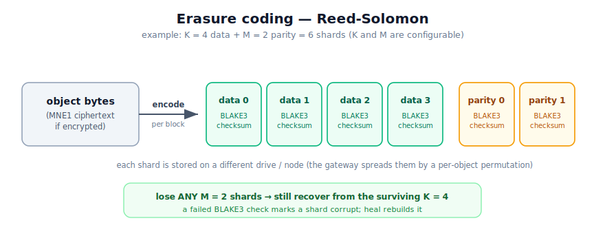

# Erasure coding — design

> Design for KerPlace's durable storage backend. Status: **draft / phase 1 in
> progress**. This is the big architectural milestone (#4): replace the
> transparent single-disk FS mirror with a sharded, redundant, **opaque**
> backend — closing the gap with MinIO (durability, bitrot protection, drives
> owned exclusively by the engine).



## 1. Goals

- **Durability:** survive the loss/corruption of up to `M` drives per object
  with no data loss (Reed-Solomon `K` data + `M` parity shards).
- **Bitrot detection + self-healing reads:** every shard is checksummed; a
  corrupt shard is detected and the object is reconstructed from the others.
- **Opaque backend:** an object is *not* a single mirror file. Files dropped
  into a drive by hand are ignored (no valid `xl.meta` → not an object). Fixes
  the "edit the backend from outside" hazard of the FS backend.
- **Drop-in via the seam:** a new `ErasureStore` implements the existing
  `ObjectStore` trait; handlers/console/SDKs are unchanged.
- **Composes with PQC at-rest encryption** (encrypt → then shard).

Non-goals (phase 1): distributed multi-node, online heal command, transitions.

## 2. Reed-Solomon model

- An object's bytes are processed in **blocks** of `blockSize` (default 1 MiB).
- Each block is split into `K` data shards and `M` parity shards
  (`N = K + M` total). Any `K` of the `N` shards reconstruct the block.
- Tolerates losing any `M` shards (drives) per object.
- Library: **`reed-solomon-erasure`** (mature, pure-Rust, supports
  reconstruction) for phase 1; `reed-solomon-simd` is a later perf option.

### Drive set & (K, M)
- Configured by `KP_ERASURE_DRIVES` = comma-separated drive paths
  (directories, ideally separate physical disks). `N = len(drives)`.
- `M` (parity) from `KP_ERASURE_PARITY` (default `N/2` rounded down, min 1);
  `K = N - M`. Example: 4 drives, parity 2 → `K=2, M=2` (survives 2 losses).

## 3. On-disk format (per drive)

```
<drive_i>/<bucket>/<key>/
  xl.meta            object metadata (replicated on EVERY drive that holds a shard)
  part.1             this drive's shard stream: shard(block0) || shard(block1) || ...
```

`xl.meta` (versioned, serialized as JSON or CBOR):
```jsonc
{
  "v": 1,
  "erasure": {
    "algo": "reed-solomon",
    "data": K, "parity": M,
    "blockSize": 1048576,
    "index": i,                 // which shard index this drive holds (0..N)
    "distribution": [...],      // shard-index → drive-slot permutation (per object)
    "checksums": ["<hex>", ...] // bitrot checksum per block for THIS drive's shard
  },
  "stat": { "size": 12345, "modTime": "...", "etag": "<md5>" },
  "meta": { "content-type": "...", "x-amz-meta-*": ... },
  "enc":  { "encrypted": true }   // payload was MNE1 before sharding (see §5)
}
```

- **Object identity = a directory with a valid `xl.meta`.** Listing only treats
  such directories as objects → hand-dropped files are ignored (opaque backend).
- `distribution` is a per-object permutation (seeded by hash(bucket+key)) so
  shards spread evenly across drives across many objects.
- **Checksum:** `blake3` per (block, shard) — fast + strong. (Alt with no new
  dep: SHA-256, already vendored.)

## 4. Data flow

### Write (PutObject)
1. Wrap body in the encrypting reader if the bucket is encrypted (existing
   path) → the stream is now the MNE1 container (or plaintext).
2. Stream block by block (`blockSize`):
   - RS-encode the block → `N` shards.
   - Append shard `j` to `drive[dist[j]]/<bucket>/<key>/part.1`.
   - Record `blake3(shard_j)` per drive.
3. Compute object ETag (md5 of the logical bytes) as today.
4. Write `xl.meta` to every drive that holds a shard (atomic temp+rename).
5. **Write quorum:** succeed iff ≥ `K + 1` drives wrote OK (else roll back).

### Read (GetObject)
1. Read `xl.meta` from any available drive (quorum: need ≥ 1 readable + agreement).
2. For each block: read the `K` (or more) available shards, **verify blake3**;
   drop shards that fail. If ≥ `K` good shards → RS-reconstruct the block.
   Fewer than `K` good shards on any block → read error (object unrecoverable).
3. Concatenate blocks → the logical (possibly MNE1) stream.
4. If encrypted, wrap in the decrypting reader → plaintext to the client.

### Delete / Head / List
- Delete: remove the object dir on every drive.
- Head: read `xl.meta` (stat/etag/content-type) from any drive.
- List: walk `<drive>/<bucket>/` for directories containing `xl.meta`; map dir →
  key. (Only need to scan one drive for the listing; cross-check optional.)

## 5. Composition with encryption (PQC)

**Encrypt, then erasure-code.** The object payload that gets sharded is the
output of the existing streaming layer:
- encrypted bucket → shards are chunks of the `MNE1` ciphertext;
- plain bucket → shards are chunks of plaintext.

So at-rest encryption and redundancy are independent and composable, and shards
never expose plaintext when encryption is on. `xl.meta.enc.encrypted` records
which, so reads re-wrap correctly.

## 6. Config & selection

| Var | Meaning |
|---|---|
| `KP_BACKEND` | `erasure` (**default**) or `fs` (legacy mirror, opt-in) |
| `KP_ERASURE_DRIVES` | comma-separated drive dirs; default = 4 sub-drives under `<data_dir>/.erasure/` |
| `KP_ERASURE_PARITY` | parity shards `M` (default `N/2`) |
| `KP_ERASURE_BLOCK` | block size bytes (default `1048576`) |

`main.rs` picks the backend; both implement `ObjectStore`, so the rest of the
server is unchanged. **`erasure` is the default** (modern MinIO removed its FS
mode in 2022); `fs` is the opt-in transparent mirror.

## 7. Phasing

- **Phase 1 — core codec + backend. ✅ DONE.**
  `src/erasure/codec.rs`: RS encode/decode/reconstruct + BLAKE3 bitrot checksum
  (5 tests). `src/erasure/store.rs`: `ErasureStore` implementing `ObjectStore` —
  bucket lifecycle, put/get/range/head/delete/list/copy over a multi-dir drive
  set, write all-drives + read-time reconstruction, per-bucket/object config
  sidecars (4 tests incl. survives-2-drive-loss+bitrot, encrypted shards,
  opaque-ignores-hand-dropped-files). Selectable via `KP_BACKEND=erasure`.
  **Validated live with `mc`:** 12 KB object across 4 drives; bitrot on one +
  total loss of another → reconstructed identically; third loss → fails.
- **Phase 2 — range reads, multipart, versioning** on the erasure backend
  (block-aligned range; per-part erasure for multipart; reuse version archive).
- **Phase 3 — heal + admin + audit. ✅ DONE.**
  `ObjectStore::heal(bucket, dry_run)` + `backend_info()` (default impls keep the
  FS backend untouched). `ErasureStore::heal` scans every object version
  (current + archived via `collect_object_dirs`), verifies each (drive, block)
  shard's BLAKE3 checksum, and rebuilds any bad/missing drive's `part.1` +
  `xl.meta` by reconstructing each block from a `≥ K` quorum and re-encoding the
  missing shards (`heal_object`). Native endpoint `POST /kerplace/admin/v3/heal`
  (`?bucket=&dryRun=`) → JSON report; `/minio/admin/v3/info` reports real backend
  type + parity + per-drive state. **Audit-versioning differentiator:** a
  per-request task-local (`src/audit.rs`) set by the auth middleware records WHO
  (access key) + WHERE (client IP, via `ConnectInfo` / `X-Forwarded-For`) on each
  version write (WHEN = the version timestamp), stamped into `xl.meta.{owner,
  src_ip}` and each `VEntry`. Surfaced compat-safely: standard S3 `<Owner>` in
  `ListObjectVersions` + `x-kerplace-author` / `x-kerplace-source-ip` headers on
  GET/HEAD (no standard response shape changed). 84 tests; validated live with
  `mc` + `curl` (wipe+bitrot two drives → heal → survives a fresh 2-drive loss;
  presigned GET shows the audit headers).
- **Phase 4 — distributed multi-node:** drives across nodes, a thin network
  storage RPC, distributed locking, quorum across nodes.

## 8. Open questions (decide as we build)
- `xl.meta` encoding: JSON (debuggable) vs CBOR (compact). → start JSON.
- Checksum: blake3 (new dep) vs sha256 (no dep). → lean blake3 for speed.
- Per-object `distribution` vs fixed order. → hash-seeded permutation.
- Single `part.1` per drive vs per-block files. → single concatenated part.
- Write quorum threshold: `K+1` vs `N/2+1`. → `K+1` (data + one).
