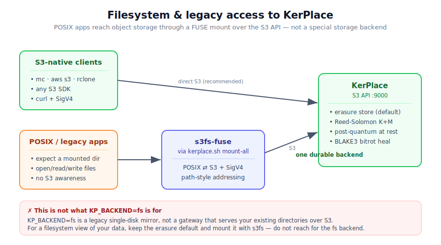

# Coming from MinIO: legacy access patterns & filesystem (FUSE) access

You ran MinIO, its open edition was stripped back, and now you're on KerPlace. Moving the **data**
across is covered by the **[Migration guide](MIGRATION.md)** and the bundled
`kerplace-migrate.sh`. This guide covers the other half: mapping the **access
patterns** you relied on — especially *"I want my objects to look like files on
a mounted disk"* — onto KerPlace without taking a wrong turn.



---

## TL;DR

- **Talk S3 if you can.** `mc`, `aws s3`, rclone and any S3 SDK work unchanged —
  this is the fast, durable, fully-supported path.
- **Need a real filesystem?** Mount a bucket with **s3fs-fuse over KerPlace's S3
  API** using the bundled `kerplace.sh`. Your apps see a directory; KerPlace
  stores erasure-coded, post-quantum-encrypted objects underneath.
- **Do *not* reach for `KP_BACKEND=fs` to get "filesystem mode".** It is a
  legacy single-disk mirror, **not** a gateway that exposes your existing
  directories over S3. The supported "filesystem" answer is *erasure backend +
  s3fs*, not the `fs` backend. See [below](#about-kp_backendfs).

---

## Filesystem access — the supported way (s3fs / FUSE)

If you have POSIX applications that expect to `open()`/`read()`/`write()` files
in a mounted directory, put a FUSE layer **on top of** KerPlace's S3 API. The
bundled **[`kerplace.sh`](../kerplace.sh)** wraps
[s3fs-fuse](https://github.com/s3fs-fuse/s3fs-fuse) and does this for you:

```bash
# point the helper at your KerPlace and credentials
export KP_URL=http://localhost:9000
export KP_ACCESS_KEY=minioadmin
export KP_SECRET_KEY=minioadmin
export KP_MOUNT_BASE=/mnt/datalake        # where buckets appear as folders

./kerplace.sh mount-all                   # every bucket → a subdir under $KP_MOUNT_BASE
./kerplace.sh mount   my-bucket           # or just one bucket
./kerplace.sh show-mount                  # dashboard: buckets, mounts, encryption, users
./kerplace.sh umount-all                  # tidy up
```

It uses **path-style addressing + SigV4**, so it talks to KerPlace exactly the
way the old MinIO mount scripts talked to MinIO. Requires `mc` and `s3fs` on the
host.

**Why this layering and not a "filesystem backend"?** Because the FUSE mount is
*decoupled* from how KerPlace stores data. Your files still land as erasure-coded
objects with post-quantum encryption at rest, bitrot healing, and versioning —
you get a POSIX *view* without giving up any object-storage durability. And the
same data is reachable over plain S3 at the same time.

> **FUSE caveats (be honest with yourself):** s3fs gives near-POSIX semantics,
> not true POSIX. Random in-place writes, `fsync` durability guarantees, hard
> links, and high-IOPS small-file workloads are weaker than a local disk.
> For databases or anything latency-sensitive, talk S3 (or use a real block
> device); use the mount for bulk file access, archives, and "drop files in a
> folder" workflows.

---

## About `KP_BACKEND=fs`

`KP_BACKEND=fs` selects KerPlace's **legacy single-disk mirror** backend. It is
**not**:

- a gateway that serves your *pre-existing* directory tree over S3 (it manages
  its own layout under `KP_DATA_DIR`; pointing it at a folder of loose files
  does **not** publish them as objects);
- a way to get a "filesystem view" of object storage (that's s3fs, above);
- the durable, recommended choice.

It **is** a simple one-directory store, kept around for development and the
simplest single-host cases. It has **no erasure coding** (no Reed-Solomon, no
multi-drive durability) — a single disk failure loses data.

| | `erasure` (default) | `fs` (legacy) |
|---|---|---|
| Durability | Reed-Solomon K+M, survives drive losses | single disk, no redundancy |
| Bitrot detection | BLAKE3 per shard, self-heal | none |
| On-disk format | opaque `kp.meta` + `kp.part` shards | plain mirror |
| When to use | **production, always** | dev / throwaway / minimal single host |

Unless you have a specific reason, **leave the default** (`erasure`). If you came
to `fs` looking for MinIO's old "FS mode" or a gateway over existing files, that
is the wrong turn — see the mapping below.

---

## MinIO concept → KerPlace path

| What you did on MinIO | Do this on KerPlace |
|---|---|
| MinIO **FS / standalone single-drive mode** | Default **erasure** backend (or `KP_BACKEND=fs` for a throwaway single-disk dev box). |
| MinIO **erasure set** across drives on one host | Default — list the drives with `KP_ERASURE_DRIVES`, set parity with `KP_ERASURE_PARITY`. |
| Drives across **separate machines** | Distributed cluster: `KP_ROLE=drive` nodes + a gateway with `KP_NODES`. See **[CLUSTERING.md](CLUSTERING.md)**. |
| **s3fs / mount the bucket** for file access | Same idea — `kerplace.sh mount-all` (s3fs over the S3 API). |
| MinIO **gateway to NAS / filesystem** (removed by MinIO) | Not reimplemented. Migrate the data in over S3 ([MIGRATION.md](MIGRATION.md)); use s3fs if you need a mount. |
| `MINIO_ROOT_USER` / `MINIO_ROOT_PASSWORD` | Honoured as fallbacks; or set `KP_ROOT_USER` / `KP_ROOT_PASSWORD`. |
| `minio server --address … <paths>` | `kerplace server --address … <paths>` — same shape. |

---

## See also

- **[MIGRATION.md](MIGRATION.md)** — move buckets, objects, versions, IAM and
  per-bucket config from a running MinIO, over the S3 + admin API.
- **[CLUSTERING.md](CLUSTERING.md)** — multi-drive and multi-node erasure layouts.
- **[SECURITY_MODEL.md](SECURITY_MODEL.md)** — at-rest encryption and key custody;
  note that your key provider (`KP_KEY_PROVIDER`) is chosen at init and is not a
  runtime switch.
- Main **[README](../README.md)** — full `KP_*` configuration reference.
