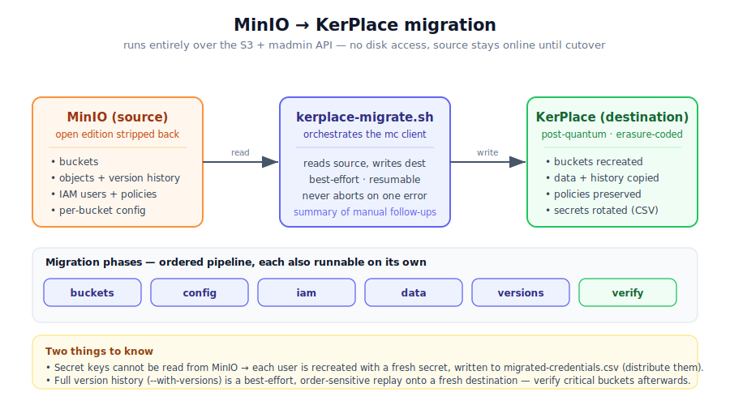

# Migrating from MinIO to KerPlace

MinIO's open edition was stripped back and moved behind a commercial offering. If
you are running the open edition in production with no upstream support, KerPlace is a
drop-in S3-compatible home for your data — with post-quantum encryption at rest and
erasure coding on top.

This guide and the bundled **[`kerplace-migrate.sh`](../kerplace-migrate.sh)** tool
take you from a running MinIO to a running KerPlace with the same buckets, objects,
versions, users and per-bucket settings.



---

## TL;DR

```bash
# 1. point mc at both servers (the source MinIO and the new KerPlace)
mc alias set oldminio  https://minio.example.com:9000  ACCESS  SECRET
mc alias set kerplace     http://localhost:9000           minioadmin minioadmin

# 2. dry-run to see the plan (no changes)
./kerplace-migrate.sh oldminio kerplace all --dry-run

# 3. migrate for real (add --with-versions to copy full version history)
./kerplace-migrate.sh oldminio kerplace all
```

That's the whole thing. The rest of this document explains what happens, the
two caveats you must know about, and how to cut over safely.

---

## Why it's not a "point KerPlace at the old data dir" migration

Two things differ between the servers, so you migrate at the **S3 level**, not
by copying disks:

| | MinIO | KerPlace |
|---|---|---|
| **Server config** | `MINIO_*` env / `config.json` | `KP_*` env (no config file) |
| **On-disk format** | MinIO's `xl.meta` v2 | KerPlace's own `xl.meta` + `part.1`, `MNE1` cipher |

What is **100% identical** is the **S3 API** and the `mc` / SDK clients. So the
migration copies data and settings through that API — which also means:

- **No disk access** to either server is required.
- The **source MinIO keeps serving** the whole time; you only cut over at the end.
- It works against any MinIO version, local or remote.

> Your existing **launch command and root credentials already work** on KerPlace:
> `kerplace server --address :9000 --console-address :9001 <path>` mirrors
> `minio server …`, and `MINIO_ROOT_USER` / `MINIO_ROOT_PASSWORD` are honoured as
> fallbacks. So you can drop KerPlace into the same systemd unit / container.

---

## The tool: `kerplace-migrate.sh`

```
./kerplace-migrate.sh <src-alias> <dst-alias> [phase] [options]
```

`<src-alias>` and `<dst-alias>` are existing `mc` aliases (the source MinIO and
the destination KerPlace). The default phase is `all`; you can also run any single
phase on its own.

### Phases (ordered pipeline)

| Phase | What it does |
|---|---|
| `preflight` | Read-only. Checks both aliases, confirms the destination is KerPlace, prints an inventory. |
| `buckets`   | Recreates every source bucket (carrying the object-lock flag). |
| `config`    | Per-bucket settings `mc mirror` does **not** carry: versioning, encryption, lifecycle (ILM), tags, quota, and anonymous (public) access policy. |
| `iam`       | Custom policies + users. See the **secret-key caveat** below. |
| `data`      | Object data + metadata of the **current** versions (`mc mirror --preserve`). Resumable. |
| `versions`  | **Opt-in** (`--with-versions`). Full object **version history** replay. |
| `verify`    | Per-bucket object-count / size comparison, source vs destination. |

Every phase is **best-effort**: a failure is reported and the run continues, so
one unsupported feature never aborts the whole migration. A **summary** at the
end lists exactly what needs manual attention.

### Options

| Option | Meaning |
|---|---|
| `--with-versions` | Also replay the full version history (slower; see caveat). |
| `--buckets "a b c"` | Restrict to these buckets (default: all source buckets). |
| `--dry-run` | Print what would happen; change nothing on the destination. |
| `--insecure` | Pass `--insecure` to `mc` (self-signed TLS). |
| `--creds-out FILE` | Where rotated user credentials are written (default `./migrated-credentials-<dst>.csv`). |
| `-h`, `--help` | Show usage. |

### Examples

```bash
./kerplace-migrate.sh oldminio kerplace                       # full migration
./kerplace-migrate.sh oldminio kerplace data --buckets "logs" # mirror just one bucket
./kerplace-migrate.sh oldminio kerplace all --with-versions   # include version history
./kerplace-migrate.sh oldminio kerplace preflight             # read-only inventory only
```

---

## Two caveats you must know

### 1. User secret keys are rotated (they can't be migrated)

MinIO **never discloses a user's secret key** over its API — by design. So the
`iam` phase recreates each user with its original access key and policy, but a
**freshly generated secret key**, and writes the new credentials to the
`--creds-out` CSV:

```
accessKey,secretKey,policy,status
appuser,e3JyJmFuUQ0ZpUQA1KaDxkU3HTauWzAC,readwrite,enabled
```

Distribute those new secrets to your users (or applications), then keep the file
safe or delete it. The file is written `chmod 600`.

Policies **are** preserved faithfully — a `readonly` user stays `readonly`, it is
not silently upgraded to `readwrite`. (MinIO's super-user policy `consoleAdmin`
maps to KerPlace's `admin`.)

### 2. Version history replay is best-effort

`mc mirror` (the `data` phase) only copies the **current** version of each
object — which is all most migrations need. The optional `versions` phase
replays the **full history** by copying every non-current version oldest→newest
and recreating delete markers. This is **order-sensitive** and assumes a **fresh
destination bucket** (don't run it twice into the same bucket). Always run it
with the `all` pipeline (which skips `data` for versioned buckets so the current
version isn't copied twice), and **verify critical buckets afterwards**.

---

## Recommended procedure

1. **Install KerPlace** next to MinIO (different port, or a new host). See
   [INSTALL.md](../INSTALL.md). Reuse the MinIO systemd unit / container —
   `kerplace server …` and `MINIO_ROOT_*` are compatible.
2. **Set both `mc` aliases** (source MinIO, destination KerPlace).
3. **Dry-run**: `./kerplace-migrate.sh src dst all --dry-run` and read the plan.
4. **Migrate**: `./kerplace-migrate.sh src dst all` (add `--with-versions` if you
   need full history). Re-run any phase freely — `buckets`, `config`, `data` and
   `iam` are idempotent.
5. **Verify**: the `verify` phase compares counts/sizes; spot-check a few
   objects with `mc cat` / `mc stat`, and confirm a migrated user can log in
   with its new secret.
6. **Cut over**: point your applications at KerPlace (swap the endpoint, hand out
   the rotated secrets). Because the source MinIO was untouched, you can flip
   back instantly if something looks wrong.
7. **Decommission** the old MinIO once you're satisfied.

### Re-syncing before cutover

If MinIO kept taking writes during the migration, re-run the `data` phase just
before cutover to catch up the delta (`mc mirror` only transfers what changed):

```bash
./kerplace-migrate.sh src dst data
```

For a true zero-write cutover, stop writes to MinIO (or set its buckets
read-only) first, run a final `data` pass, then switch.

---

## What is *not* carried automatically

- **Bucket notifications, replication rules, tiers** — KerPlace doesn't implement
  these yet; re-create any you depend on.
- **Service accounts / STS** — only top-level users are migrated.
- **KMS-managed keys** — KerPlace encrypts at rest with its own post-quantum keys;
  objects are re-encrypted on write to KerPlace, they are not key-wrapped from MinIO.

These show up as warnings in the run summary where detectable, so you have a
checklist of manual follow-ups.

> **Decide your key custody before you migrate.** KerPlace's at-rest provider
> (`KP_KEY_PROVIDER`) is chosen when the data directory is initialised and is
> **not a runtime switch** — each provider only reads what it wrote (see
> `SECURITY_MODEL.md` §3). The simplest start is the default `file`, but if you
> intend to mature to external KMS custody (`kms`), it is cheapest to migrate
> straight onto `kms`: moving an existing `file` deployment to `kms` later means
> re-wrapping every object (block 🗓️ K7), not flipping a flag.

---

## Troubleshooting

Run the destination with debug logging and capture the output:

```bash
KP_DEBUG=debug ./kerplace > kerplace.log 2>&1
```

`KP_DEBUG=debug` logs every request (method, path, status, latency). See the
[README troubleshooting section](../README.md#troubleshooting). For the tool
itself, `--dry-run` shows the exact `mc` commands it would run.
