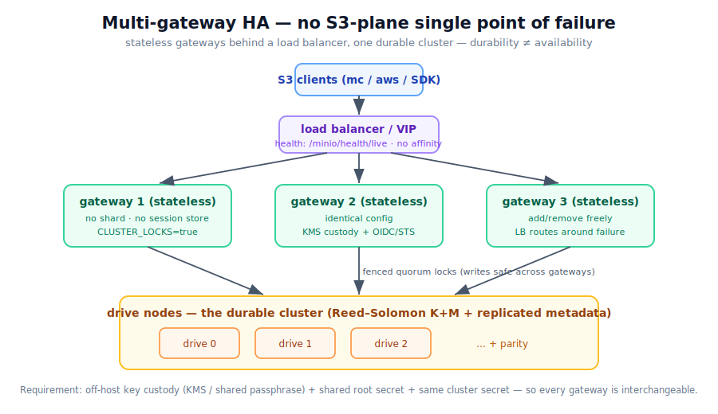

# Multi-gateway HA (no S3-plane single point of failure)

> KerPlace separates **durability** from **availability**. A distributed cluster
> already survives drive/node loss (Reed–Solomon K+M + replicated metadata — see
> [CLUSTERING.md](CLUSTERING.md)), but a *single* gateway is an **availability**
> SPOF: if it dies, the S3 endpoint is down even though the data is intact.
>
> This document describes the supported HA topology: **several stateless gateways
> behind a load balancer, against one cluster**. It is mostly a *deployment*
> concern — the primitives (strict lock fencing, distributed quorum locks,
> stateless auth) already exist.



## The idea

```
            ┌─────────────┐
   clients  │ load balancer│  (round-robin / least-conn, health-checked)
      ──────▶│   or VIP    │
            └──────┬──────┘
        ┌──────────┼──────────┐
        ▼          ▼          ▼
   ┌────────┐ ┌────────┐ ┌────────┐     stateless gateways
   │gateway1│ │gateway2│ │gateway3│     (identical config, no local state)
   └───┬────┘ └───┬────┘ └───┬────┘
       └──────────┼──────────┘
                  ▼
        ┌───────────────────┐
        │  drive nodes (RS)  │   the cluster: holds all object data
        └───────────────────┘
```

Each gateway is a full S3 endpoint that talks to the same drive nodes. Add or
remove gateways freely; the load balancer routes around a dead one. Object data
never lives on a gateway.

## Why this is safe (the primitives)

1. **Strict lock fencing** — concurrent writes to the same key from *different*
   gateways are serialised by distributed quorum locks with monotonic **fencing
   tokens**; a drive rejects a stale-token write (HTTP 412). Enable with
   `KP_CLUSTER_LOCKS=true` on every gateway. (Local per-object locking is always
   on; this adds the *cross-gateway* guarantee.)
2. **Stateless authentication** — nothing about auth lives in a single gateway's
   memory:
   - **SigV4 users** resolve from shared config / `KP_USERS` (or `users.json`);
   - **console sessions** are HMAC tokens over the root secret (any gateway
     verifies them);
   - **STS credentials** (`AssumeRoleWithWebIdentity`) are **self-validating** —
     the policy + expiry are HMAC-signed into the access key, so any gateway
     re-derives and accepts them with no shared session store (see
     [SECURITY_MODEL.md](SECURITY_MODEL.md) §5).
3. **Replicated metadata** — bucket/object metadata is written to every drive and
   read from any survivor, so all gateways see a consistent view.

## Requirements (what makes the gateways *identical*)

For gateways to be interchangeable, every gateway must agree on identity and key
custody. The cleanest way is the regulated posture:

| Concern | Requirement | Why |
|---|---|---|
| Key custody | **`KP_KEY_PROVIDER=kms`** (recommended) | The default `file` provider generates a **random per-host** `master.key`; gateways could not read each other's objects. An off-host KEK in the KMS makes every gateway use the same KEK with zero shared files. (`passphrase` *can* work too, but it derives the KEK from a per-data-dir random salt — you'd have to copy `.kerplace.sys/passphrase.{salt,check}` to every gateway as well, so `kms` is cleaner for HA.) |
| Identity | Shared `KP_ROOT_USER`/`KP_ROOT_PASSWORD`, and ideally **OIDC** (`KP_OIDC_ISSUER`) + STS | The root secret signs console + STS tokens; OIDC removes per-gateway user state entirely. |
| Cluster wiring | Same `KP_NODES` + `KP_CLUSTER_SECRET`; `KP_CLUSTER_LOCKS=true` | Same drive set, same RPC secret, cross-gateway write safety. |
| Erasure geometry | Same `KP_ERASURE_PARITY` / `KP_ERASURE_BLOCK` | Gateways must encode/locate shards identically. |

> A gateway hosts **no shard** of its own here (`KP_NODE_INDEX` unset) — it is pure
> S3 front-end. Drives run as separate `KP_ROLE=drive` nodes.

## Example

Drive nodes (3, each on its own host):

```bash
KP_ROLE=drive KP_CLUSTER_SECRET=$SECRET KP_ADDRESS=0.0.0.0:9100 KP_DATA_DIR=/data ./kerplace
```

Each gateway (identical on every front-end host, behind the LB):

```bash
KP_NODES="0=drive0:9100,1=drive1:9100,2=drive2:9100" \
KP_CLUSTER_SECRET=$SECRET \
KP_CLUSTER_LOCKS=true \
KP_ERASURE_PARITY=1 \
KP_KEY_PROVIDER=kms KP_KMS_ENDPOINT=$VAULT KP_KMS_KEY=kerplace KP_KMS_TOKEN=$VTOKEN \
KP_OIDC_ISSUER=$IDP KP_OIDC_CLIENT_ID=kerplace KP_OIDC_CLIENT_SECRET=$CS \
KP_ROOT_USER=$RU KP_ROOT_PASSWORD=$RP \
KP_ADDRESS=0.0.0.0:9000 ./kerplace
```

## Load balancer

- **Algorithm:** round-robin or least-connections; no session affinity is needed
  (gateways are stateless).
- **Health check:** `GET /minio/health/live` (or `/kerplace/health/live`) — 200 =
  in rotation. These bypass auth by design.
- **TLS:** terminate at the gateways (`KP_TLS`) or at the LB; for a regulated
  posture keep TLS end-to-end.

## Honest limits

- **The cluster (drive nodes) must be reachable** from every gateway — the drives
  are the durable tier and have their own redundancy. The *gateway→drive* RPC is
  bearer-authenticated over an overlay by default, or **mutually TLS-authenticated**
  with `KP_CLUSTER_TLS=true` (CA-issued per-node certs — see
  [SECURITY_MODEL.md](SECURITY_MODEL.md) §4).
- **No cross-gateway cache coherence is needed** today (gateways don't cache
  object data); the only shared mutable state is in the cluster itself.
- This is **HA for the S3 plane**, not geo-replication — all gateways and drives
  are one cluster/site. Multi-site DR is a separate (larger) effort.
