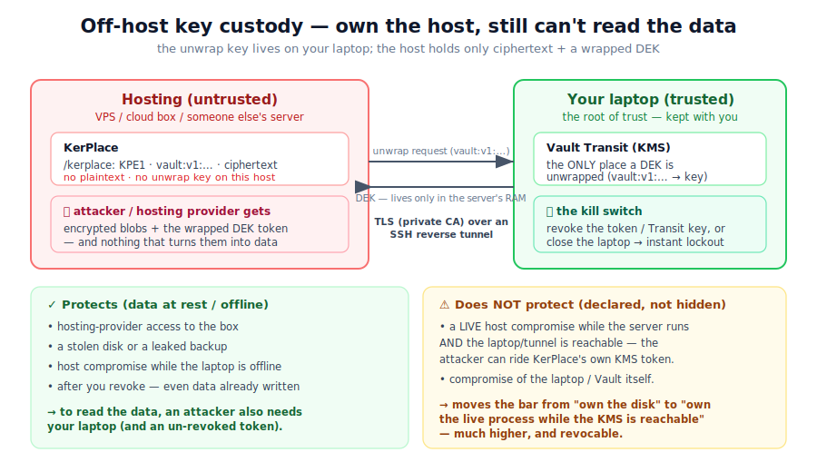
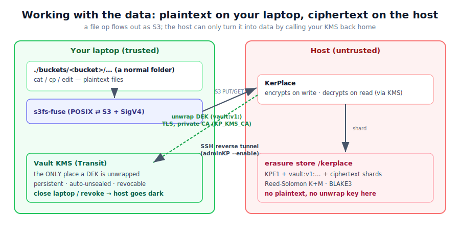

# Off-host key custody: your data on their host, your keys on your laptop

This is one of KerPlace's most powerful deployments, and it is real — we run it
live:

> **You rent hosting (a VPS, a cloud box, someone else's server) and store your
> objects there. If an attacker — or the hosting provider — gets full access to
> that host, they still cannot read your data. To read it, they would also need
> your laptop, because the key that unwraps the data never leaves it.**

It works because KerPlace's key custody is *pluggable* (`KP_KEY_PROVIDER`) and the
`kms` provider keeps the wrapping key in an external KMS — here, a HashiCorp Vault
**running on your own laptop**, reached by the host over an encrypted tunnel.



---

## The guarantee — and the honest limit

**What this protects (data at rest / offline):**

- **Hosting-provider access** — the people who run the box can read every file on
  it and still get only ciphertext.
- **A stolen disk or a leaked backup** of the host — useless without the laptop.
- **A host compromise while your laptop is offline / the tunnel is down** — there
  is simply no key to unwrap with; reads fail closed.
- **Revocation** — revoke the token or the Transit key on your laptop and the
  host loses the ability to decrypt *immediately*, even for data already written.

**What it does NOT protect (be honest):**

- **A live host compromise while the server is running and the laptop is
  reachable.** At that moment KerPlace itself can call the KMS with its token, so
  an attacker with code execution on the host can ride that same path to decrypt
  data that passes through. Off-host custody moves the bar from "own the disk" to
  "own the running process *while* the operator's KMS is reachable" — a much
  higher and *revocable* bar, but not infinite.
- **Compromise of the laptop / the Vault itself** — that is the root of trust.

This is exactly what KerPlace prints at startup, so nobody is misled:

```
key custody `kms` — protects media theft, a full data-directory backup, AND data
at rest once the KMS revokes the key/token — the unwrap key never touches this
host; does NOT protect a live host compromise that can call the KMS with our
token while the server runs, or compromise of the KMS itself
        provider="kms" unattended_boot=true key_on_host=false
```

---

## How it works

KerPlace uses **envelope encryption**:

1. Each object is encrypted with a random **data key (DEK)**.
2. The DEK is **wrapped** (sealed) by the KMS and stored *next to the object* as an
   opaque token — never in the clear. With Vault Transit the wrapped form looks
   like `vault:v1:…`.
3. To read an object, KerPlace sends that token back to the KMS to **unwrap** it.
   The unwrap is a network round-trip to **your laptop**; the host never holds the
   key that performs it.

So the host stores only: **ciphertext + a `vault:v1:` wrapped DEK**. The one place
those tokens can be turned back into a usable key is the Vault on your laptop.

```
┌──────────── Hosting (untrusted) ────────────┐         ┌──── Your laptop (trusted) ────┐
│  KerPlace  ──────────────────────────────────┼──TLS───▶│  Vault Transit (KMS)          │
│  /kerplace : KPE1 + vault:v1:… + ciphertext  │ tunnel  │  the ONLY place a DEK unwraps │
│  (no plaintext, no unwrap key)               │◀────────┼─  revoke = instant lockout    │
└──────────────────────────────────────────────┘         └───────────────────────────────┘
```

The transport is an **SSH reverse tunnel** (the host reaches the laptop as
`https://localhost:8200`), and the Vault is served over **TLS with a private CA**
that KerPlace is told to trust via `KP_KMS_CA`. Even though the SSH tunnel already
encrypts the hop, the KMS TLS gives end-to-end certificate-pinned trust.

---

## The reference setup

Two pieces. The laptop runs the KMS; the host runs KerPlace pointed at it.

### On your laptop — the KMS

A persistent, TLS-enabled Vault (Transit engine, key `kerplace`). The bundled
[`deploy/external-kms-laptop/`](../deploy/external-kms-laptop/) compose + `start.sh`
bring it up, initialise & unseal it, and mint a least-privilege token. See
[`deploy/external-kms-laptop/README.md`](../deploy/external-kms-laptop/README.md).

Then open the reverse tunnel so the host can reach it:

```bash
ssh -N -R 8200:localhost:8200 user@your-host     # AWS:localhost:8200 -> laptop Vault
```

(Run it as a service — e.g. a `systemd --user` unit with `Restart=always`, or
`autossh` — so it survives logout and reboots. The Vault should be persistent and
auto-unsealed for the same reason.)

### On the host — KerPlace

```bash
KP_DATA_DIR=/kerplace \
KP_ENCRYPT=true \
KP_KEY_PROVIDER=kms \
KP_KMS_ENDPOINT=https://localhost:8200 \
KP_KMS_KEY=kerplace \
KP_KMS_TOKEN=<the scoped Vault token> \
KP_KMS_CA=/etc/kerplace/kms-ca.crt \
kerplace
```

| Variable | Meaning |
|---|---|
| `KP_KEY_PROVIDER=kms` | Use the external KMS for key custody. |
| `KP_KMS_ENDPOINT` | The KMS URL — `https://localhost:8200` via the reverse tunnel. |
| `KP_KMS_KEY` | The Vault Transit key name (`kerplace`). |
| `KP_KMS_TOKEN` | A **scoped** Vault token (only `datakey` + `decrypt` on that key). |
| `KP_KMS_CA` | PEM of your private CA, so KerPlace trusts the Vault TLS cert. |
| `KP_KMS_TLS_SKIP_VERIFY` | Dev only — disables KMS TLS verification. Don't use in prod. |

At boot KerPlace runs a **fail-closed check**: it does a real `datakey → decrypt`
round-trip against the KMS and refuses to start if it cannot. So if the laptop is
unreachable, the host does not come up serving — it fails loudly, by design.

---

## What an attacker who owns the host actually sees

Log into the host as root and look at the bytes on disk:

```
$ sudo head -c 24 /kerplace/.erasure/disk0/<bucket>/<key>/kp.part | strings
KPE1 ... vault:v1:IuaOhI0...        ← container magic + the WRAPPED DEK token

$ sudo grep -r "my secret text" /kerplace
(nothing — the plaintext is not on the host)
```

They hold the ciphertext and the `vault:v1:` token. Neither yields the data
without your laptop's Vault unwrapping that token — and the moment you suspect
trouble, you revoke it.

---

## The kill switch (revocation)

From your laptop, any of these instantly cuts the host's ability to decrypt:

```bash
vault token revoke <the scoped token>        # this deployment's access
vault lease revoke -prefix auth/token        # everything
vault secrets disable transit                # or remove the key entirely
```

…or simply **close the laptop / drop the tunnel**. KerPlace on the host will then
fail-closed on reads (and refuse to boot), because there is no longer a key to
unwrap with.

---

## Day-to-day: a VPN-style control script

Reaching this data is deliberately like a corporate VPN — you *connect* to start
work and *disconnect* when you are done. A single control script (the reference is
**[`deploy/external-kms-laptop/adminKP.sh`](../deploy/external-kms-laptop/adminKP.sh)**)
drives the whole lifecycle from the laptop:

```bash
./adminKP.sh --enable                 # connect: KMS up → tunnel → start KerPlace → mount buckets
./adminKP.sh --disable                # disconnect: unmount → stop KerPlace → drop tunnel (host isolated)
./adminKP.sh --mount  <bucket> [path] # mount one bucket ad-hoc (default ./buckets/<bucket>)
./adminKP.sh --umount <bucket|path>   # unmount one (by name or path)
./adminKP.sh --backup [file]          # encrypted KMS snapshot (disaster recovery)
./adminKP.sh --status                 # what's up / mounted
```

`--enable`, in order: (1) ensures the local Vault (KMS) is up and **unsealed**;
(2) brings up the reverse tunnel and checks the host can reach the KMS over TLS;
(3) starts KerPlace on the host — its fail-closed boot check now passes because the
KMS is reachable; (4) mounts every bucket as a local folder. `--disable` reverses
it cleanly: flush + unmount, stop KerPlace, then **drop the tunnel** so the host is
fully isolated from your keys again.

> **The script is the single on/off switch.** KerPlace's auto-start on the host and
> the tunnel's auto-start are disabled on purpose; only the local Vault stays
> always-up (persistent + auto-unsealed via `systemd --user` + linger), holding the
> keys. So "not working" literally means the host cannot reach the means to decrypt.

---

## Buckets as local folders (FUSE)

While connected, your buckets appear as ordinary directories — by default under
`./buckets/<bucket>` — via [s3fs-fuse](https://github.com/s3fs-fuse/s3fs-fuse):

```bash
cat   ./buckets/photos/2026/trip.jpg     # just a file
cp    ~/report.pdf ./buckets/docs/        # uploads it (encrypted at rest)
```

Every read/write is, underneath:

```
your file op → s3fs → S3 (SigV4) → KerPlace on the host → unwrap DEK via your KMS → erasure store
```



So you work with plaintext files locally while, on the host, they live as
erasure-coded, KMS-wrapped ciphertext. The same data is reachable over plain S3
(`mc`, SDKs) at the same time.

> **FUSE caveats (honest):** s3fs gives *near*-POSIX semantics, not full POSIX —
> random in-place writes, `fsync` durability, hard links and high-IOPS small-file
> workloads are weaker than a local disk. Great for documents, media, archives and
> "drop files in a folder"; for databases, talk S3 directly. See also
> [Legacy & filesystem access](LEGACY_ACCESS.md).

---

## Encryption in this deployment

KerPlace decides whether to encrypt **per object, on every write**, as an OR of
three inputs (`src/handlers/object.rs`):

```
encrypt = (request header x-amz-server-side-encryption: AES256)
       OR (the bucket has a default SSE config)
       OR (KP_ENCRYPT is true globally)
```

**Here `KP_ENCRYPT=true`, so everything is always encrypted** — the per-bucket and
per-request inputs can only *add* encryption, never remove it. (`mc stat <obj>`
shows `Encryption: SSE-S3`; on disk you see `KPE1` + a `vault:v1:` token.)

- **Can encrypted and unencrypted objects coexist?** At the object level, yes — the
  `encrypted` flag is stored per object, so a bucket can hold a mix (e.g. objects
  written while `KP_ENCRYPT` was off, plus newer encrypted ones). But with the
  global flag on, **every new write is encrypted**. For a real mix, run with
  `KP_ENCRYPT=false` and enable encryption **per bucket**.

- **Encrypting a bucket with `mc`** works — KerPlace implements the standard
  `PutBucketEncryption` API:
  ```bash
  mc encrypt set sse-s3 <alias>/<bucket>   # future objects in this bucket get encrypted
  mc encrypt info       <alias>/<bucket>
  mc encrypt clear      <alias>/<bucket>
  ```

- **Mind the distinction:** `mc encrypt info` reports the *bucket's SSE config*, NOT
  whether objects are actually encrypted. With the global flag, objects are
  encrypted even though `mc encrypt info` may say "not configured." To check a real
  object, use `mc stat` (or look for `KPE1`/`vault:v1:` on the host).

- **It is not retroactive.** Enabling encryption affects *future* writes only;
  existing objects keep whatever state they were written with. To encrypt existing
  objects, **rewrite them** — a server-side copy onto themselves re-writes through
  the current encrypt decision:
  ```bash
  mc cp --recursive <alias>/<bucket>/ <alias>/<bucket>/
  ```

- **No remount needed.** s3fs speaks plain S3; server-side encryption is
  transparent, so toggling it never disturbs the FUSE mount.

---

## Two different backups (don't confuse them)

You have **two independent things to back up**, and need both for full recovery:

| What | How | Why it matters |
|---|---|---|
| **The KMS** (keys/config) | `./adminKP.sh --backup` → one gpg-encrypted archive | Without it the DEKs can never be unwrapped → the host's ciphertext is permanently undecryptable. |
| **The bucket data** | classic backup of the mounted `./buckets/` dirs while `--enabled` | The objects themselves. |

`--backup` snapshots exactly what rebuilds the KMS on a reinstalled laptop: the
**Vault storage** (the non-exportable Transit key lives there), the **unseal key**
(`.vault-init.json`), the **TLS CA/cert**, the compose/config/scripts, and a
`RESTORE.md`. Restore = `docker compose up` + restore the volume + unseal → the
*same* Transit key is back, and the host (whose `KP_KMS_TOKEN`/`KP_KMS_CA` are
unchanged) decrypts again. A read-path **DEK cache** (`KP_KMS_CACHE_TTL`, default
300s) serves recently-read objects briefly without a KMS call; writes always mint a
fresh key, so a write needs the KMS live.

> **The `./buckets/` backup is plaintext.** You read those folders through the
> decrypting path, so a classic backup of them captures *decrypted* data — protect
> it accordingly. If instead you copy the host's `/kerplace` directly, that copy is
> ciphertext and is useless without the KMS — which can be exactly the point.

---

## Resilience: closing the laptop

Shutting the laptop does **not** lose your data:

- the **objects** live on the host, untouched;
- the **key** lives in the Vault file-storage volume on the laptop, on disk — it
  survives shutdown.

While the laptop is off the host can't reach the KMS, so the buckets are
**temporarily inaccessible** (reads fail-closed once the cache window passes;
KerPlace refuses to restart) — inaccessible, *not lost*. On power-up,
`systemd --user` + linger bring the Vault back and auto-unseal it, the tunnel
reconnects, and a `--enable` restores access. Across very long gaps the only thing
to mind is the scoped token's TTL (e.g. 720h) — re-mint it if it lapses (the
generated `RESTORE.md` shows how).

> **Crown-jewel rule:** the laptop Vault *is* the root of trust. Keep it persistent,
> run `--backup` and store that archive off the laptop, and never lose
> `.vault-init.json`. Lose those without a backup and the data is gone.

---

See also: the broader [Security model](SECURITY_MODEL.md) (§3, key custody), the
[reference deployment](../deploy/external-kms-laptop/README.md), and
[Legacy & filesystem access](LEGACY_ACCESS.md).

---

*Want this deployment for your own data — on your own hosting, or as a managed
service? Email **support@kerplace.com**.*
