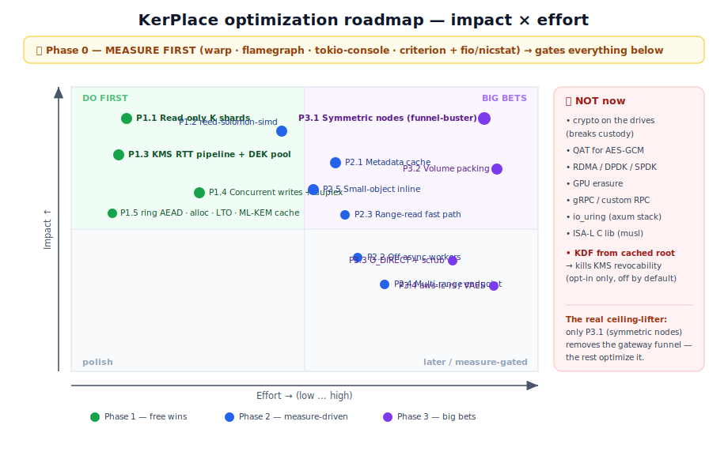

# KerPlace performance: findings, objectives & roadmap

> **Status: Phase 0 done, first wins shipped.** This document began as a multi-agent
> study of where KerPlace's performance goes. The measurement harness (Phase 0) is now
> built and the first two optimizations are **implemented and measured** — see
> [Implemented and measured](#implemented-and-measured) below. The rest of the roadmap
> remains a *prioritized menu*; the harness keeps gating each change on a real delta.

---

## Implemented and measured

*(updated 2026-06-28)*

Phase 0 is built: a committed bench harness — `criterion` microbenchmarks, a `minio/warp`
end-to-end harness (`bench/run.sh`), and CPU flamegraphs. Two optimizations have shipped,
each gated on a measured delta (full numbers and method in
[`benches/BASELINE.md`](../benches/BASELINE.md)):

**1 · `ring` AES-256-GCM for the object/DEK path** — replaced the RustCrypto `aes-gcm`
path (AES-NI single-block) with `ring` (assembly + VAES). Byte-compatible: the on-disk
`KPE1` format is unchanged, so existing objects still decrypt. **≈ +25% GET, +7% PUT.**
A measure-first catch: dropping `ring` in naively *regressed* GET ~2× — its fast decrypt
overran a tiny in-process streaming pipe and ping-ponged one chunk per wakeup. Enlarging
the pipe (`STREAM_PIPE_BUF`) released the win, so the two changes ship together.

**2 · Skip the MD5 ETag on the encrypted path** — the flamegraph's surprise: `md5` (the
S3 ETag) was the single biggest on-CPU cost of a PUT (~32%). Encrypted objects already
carry an opaque, non-deterministic ETag (the stored bytes are ciphertext under a fresh
key — exactly as AWS does for server-side-encrypted objects), so the MD5 bought nothing.
It is now skipped whenever its result isn't the ETag (encrypted objects, and multipart
where the ETag is supplied); unencrypted single PUTs keep the real `md5(bytes)`.
**≈ +110% single-stream PUT, +16–25% at concurrency 8** (on real disk).

> **Method note, learned the hard way:** benchmark storage on the medium you deploy on.
> On RAM-backed tmpfs many concurrent writers contend on page-allocation locks, which
> *inverted* the MD5 result — a +110% single-stream win looked like a −30% regression at
> concurrency 8 until the data dir moved to real NVMe (then +16–25%). Comparing
> `--concurrent 1` against c8 separates a true regression from a contention artifact.

> All figures are dev-hardware and **directional** — re-validate on the target deployment
> (the `ring`/VAES edge shrinks on older CPUs; disk and KMS round-trips shift the balance).

---

## 1. The honest bottleneck

KerPlace's defining design choice: **the gateway concentrates all compute** —
AES-256-GCM, the envelope DEK wrap (ML-KEM / Argon2id / Vault Transit), Reed-Solomon
erasure coding, and BLAKE3 integrity hashing all run in `ErasureStore` on the
gateway. **Drive nodes are dumb**: the `Drive` trait exposes only positioned byte
I/O (read/write/read_at); they do zero compute.

- **Distributed mode:** the gateway is the **CPU + NIC funnel**. For an object of
  size *S* under a *K+M* code it does all the crypto+RS on one box and pushes *K+M*
  shards out one NIC — a write-amplification of *(K+M)/K*. Adding drives adds
  durability and capacity, **not throughput**. Symmetric designs (MinIO, RustFS)
  spread compute+NIC across every node, so aggregate throughput scales with node
  count. **This is the real structural gap**, not implementation polish.
- **Mono-node** (the common deployment — e.g. our AWS box with 4 local erasure
  disks): KerPlace and MinIO are on **even footing** — both compute on one machine.
  Here the gap is **implementation maturity** (SIMD codec, off-runtime crypto,
  fewer copies), which is the *portable* part we can close.
- **It's a deliberate trust trade:** concentrating crypto means **only the gateway
  ever touches plaintext + keys**; drives only see ciphertext shards. That small
  trust surface is exactly what makes the [off-host KMS custody](OFFHOST_KMS_CUSTODY.md)
  story work. The performance answer is to make the *gateway path* faster — **not**
  to relocate crypto onto the drives.

---

## 2. ⭐ Phase 0 — measure first (do this before changing one line)

Every domain of the study reached the same conclusion: we are optimizing blind, and
the highest-value action is to stop. Build a committed harness, capture a baseline at
a known commit, and let the numbers drive Phases 1–3.

1. **Make the binary profilable.** `[profile.release] debug = true`; pin the CPU
   governor to `performance`; freeze the dataset and `KP_*` config.
2. **Microbench the inner loops** (`criterion`, in `benches/`): AES-256-GCM seal/open
   of a 64 KiB chunk; `Codec::encode_block` / `reconstruct_block` at the real block
   size; `blake3` of one shard; ML-KEM encap/decap; `unwrap_dek`. → CPU-per-GB
   ceilings; settles "is the floor crypto or erasure?"
3. **End-to-end S3 load** with **`minio/warp`** (SigV4-native, GET/PUT/STAT/LIST/MIXED,
   object-size mixes, p50/p99). Concurrency sweep; find the latency knee. Run twice:
   **mono-node local disks** and **distributed**.
4. **CPU flamegraph under load** (`cargo flamegraph` / `samply`) — *the decisive
   step*. Whether time lands in `aes_gcm`, `reed_solomon`, `blake3`, `serde_json`
   (metadata parse), `tokio::fs`, or `reqwest` decides everything below.
5. **Async-stall check** (`tokio-console`, `--cfg tokio_unstable`). Long per-task
   poll durations = crypto/RS starving the runtime → justifies moving them off the
   async workers. No long polls ⇒ skip that work.
6. **Isolate the subsystems** by toggling one variable: `KP_ENCRYPT` on/off (crypto's
   share), `KP_BACKEND=fs` vs `erasure` (RS's share), `file` vs `kms` provider (KMS
   RTT cost), mono-node vs distributed (metadata/RPC RTT).
7. **Hardware ceilings:** `fio` (per-drive MB/s + IOPS, with/without O_DIRECT),
   `nicstat`/`sar` (NIC saturation). If the NIC or disk is already saturated, no CPU
   work below matters yet.

**Deliverable:** a `bench/run.sh` that boots a frozen config, warms up, runs a fixed
warp workload across a concurrency sweep, and drops warp CSV + `flamegraph.svg` +
`mpstat`/`iostat` into a timestamped dir. Track per run: throughput (GB/s + ops/s),
p50/p99, CPU-seconds/GB, allocs/op, and **write-amplification** (disk bytes ÷ logical
bytes). Commit a baseline so every later change is a measured delta.

---

## 3. Findings, grounded in the code

These were verified by reading the source. Several correct earlier assumptions.

| # | Finding | Where |
|---|---|---|
| F1 | **Reed-Solomon runs SCALAR today** — `reed-solomon-erasure` is pulled without the `simd-accel` feature ⇒ scalar GF(2⁸), no SIMD. RS is the #1 gateway CPU cost and it's running with the brakes on. | `Cargo.toml`, `src/erasure/codec.rs` |
| F2 | **Healthy reads do ~2× the work needed** — `reconstruct_into` reads **all N** shards and BLAKE3-hashes each, every GET, even when the K data shards verify (parity is then unused). At parity=N/2 that's ~50% redundant read I/O + hashing. | `src/erasure/store.rs` `reconstruct_into` (~L988), heal pass-1 (~L867) |
| F3 | **KMS `datakey` RTT is on the critical write path, serial** — `encrypting_reader` awaits the Vault round-trip **before** writing the header or reading any body byte. Over an off-host Vault (SSH tunnel) that's tens of ms **per PUT**. Reads have a TTL DEK cache; writes have no pooling/pipelining. | `src/crypto/mod.rs` `encrypting_reader` (~L606), `src/crypto/provider.rs` |
| F4 | **Crypto + RS run inline on the async tokio workers** (one `spawn`ed task, serial chunks). Under concurrent requests this starves the runtime (tail latency, head-of-line blocking). No rayon / `spawn_blocking` for the bulk codec/cipher. | `src/crypto/mod.rs` (`stream_chunks` ~L741), `src/erasure/store.rs` |
| F5 | **Metadata is read uncached on nearly every op** — `read_xl` re-parses `kp.meta` JSON each call; `read_history` fans out to **all N** drives to pick the highest epoch (N HTTP RTTs per versioned op in distributed mode). | `src/erasure/store.rs` `read_xl` (~L396), `read_history` (~L620) |
| F6 | **`RemoteDrive` already streams** (duplex + spawned streaming PUT) — the module doc saying it "accumulates in memory" is **stale, fix it**. The real write issue: the duplex is **64 KiB** but a shard is ~256–512 KiB, and per-drive `write_all` is serial ⇒ the K+M PUTs effectively serialize. | `src/cluster/remote.rs` (~L167), `src/erasure/store.rs` (~L500) |
| F7 | **`ring` AES-256-GCM is already a dependency** (via rustls) — a faster assembly AEAD is already compiled in. The object path uses RustCrypto `aes-gcm` 0.10 (AES-NI single-block, **no VAES/AVX-512**; 0.11 adds it). | `Cargo.lock`, `src/crypto/mod.rs` |
| F8 | **ML-KEM decap key is rebuilt from seed on every read** — `PqKeypair::dk()` runs the full key expansion per GET for the `file` provider. | `src/crypto/mod.rs` (~L238) |
| F9 | **Range reads are O(start)** — `get_object_range` decrypts the whole prefix and discards it, instead of using the seek path `ObjectCipher` already supports. | `src/erasure/store.rs` `get_object_range` (~L1189) |
| F10 | **Per-object directory layout** (one dir + `kp.meta`/`kp.part` per drive per object) is a syscall storm on tiny (4 KB) objects — KerPlace's worst case, where MinIO/RustFS/SeaweedFS win. | `src/erasure/store.rs` |
| F11 | **Allocation churn on the hot path** — per-shard hex `String` checksums, per-block `Vec<Vec<u8>>`, per-chunk cipher `Vec`, `.to_vec()` RPC copies. No allocator override, no LTO tuning. Chunk size is 64 KiB; chunk AAD is empty. | `src/erasure/codec.rs`, `src/crypto/mod.rs`, `src/main.rs` |

---

## 4. The roadmap (phased)

Each item: **what / why → where → impact / effort+risk.** "Impact" is an honest
estimate to be confirmed by Phase 0.

### Phase 1 — "free" wins (low risk, ship regardless of where the bottleneck lands)

- **P1.1 Read only K shards on the happy path** *(F2)* — fetch the K data shards
  first; pull parity only when a shard is missing/bad. `store.rs` reconstruct +
  heal. **Impact: high** (up to ~50% less GET read I/O + hashing, same win
  mono-node). **Effort S / risk low.** *The single best quick win — flagged by two
  independent domains.*
- **P1.2 Switch to `reed-solomon-simd`** *(F1)* — pure-Rust runtime SIMD (AVX2/NEON),
  musl-clean (unlike the C `simd-accel` feature). **Impact: high** on the RS CPU
  floor (~3–8× on the GF math). **Effort M / risk M** — different algorithm ⇒ parity
  bytes differ ⇒ **not byte-compatible**, needs a format/version gate + dual-decode
  for legacy objects. *Verify the scalar gap with a microbench first.*
- **P1.3 Pipeline + pool the KMS `datakey` RTT** *(F3)* — overlap the Vault
  round-trip with reading the first chunk (`tokio::join!`), then a bounded
  pre-minted single-use DEK pool removes the RTT from the hot path entirely. **Impact:
  highest for the off-host-KMS deployment** (RTT-bound → I/O-bound). **Effort S→M /
  risk low** — custody/revocation unchanged (each DEK is a real, single-use Vault
  token).
- **P1.4 Concurrent per-drive writes + right-size the duplex** *(F6)* — `join_all`
  the per-block shard writes and make the pipe ≥ shard size, so the K+M PUTs overlap.
  **Impact: high** (distributed write wall-clock → `max(drive)` not `sum(drive)`).
  **Effort S–M / risk med** (bound in-flight buffers). *Also fix the stale doc.*
- **P1.5 Cheap CPU/alloc hygiene** *(F7,F8,F11)* — swap the object AEAD to `ring`
  (already a dep, KPE1 byte-compatible, behind a trait for A/B); cache the ML-KEM
  decap key instead of rebuilding from seed; store/compare BLAKE3 as bytes not a hex
  `String`; add a global allocator (jemalloc or mimalloc); `lto="fat"`,
  `codegen-units=1`. **Impact: small–med each, cumulative.** **Effort S / risk low**
  (test the allocator with the static musl build).

### Phase 2 — structural (driven by Phase 0 numbers)

- **P2.1 Gateway metadata cache** *(F5)* — cache the parsed `XlMeta`/history (skip the
  JSON reparse and the per-op drive round-trips), invalidated **write-through at the
  existing per-object lock** (`store.rs` ~L1147), respecting `epoch`; short TTL bounds
  cross-gateway staleness (same model the DEK cache uses). Crates: `moka` /
  `quick_cache`. **Impact: large for small-object / LIST / distributed.** **Effort M /
  risk med** (invalidation correctness is the whole game).
- **P2.2 Move AES + RS off the async workers** *(F4)* — `spawn_blocking`/bounded
  rayon, **only if `tokio-console` shows long polls**. **Impact: p99 + throughput
  under concurrency.** **Effort M / risk med** (size the pool vs tokio workers).
- **P2.3 Range-read fast path** *(F9)* — seek to the first needed block→chunk instead
  of decrypting the prefix. **Impact: huge for tail-range GETs of large objects,**
  zero for full GETs. **Effort M / risk med** (offset alignment math).
- **P2.4 Parallelize metadata fan-out + a batched multi-range drive endpoint** *(F5)*
  — `join_all` the per-drive meta loops; add a `read_multi` RPC so a large GET is
  `O(K)` requests, not `O(blocks×K)`. **Impact: med–high** (collapses RPC count /
  fixed RTT overhead). **Effort S→M / risk med** (touches the `Drive` seam).
- **P2.5 Small-object inline** *(F10)* — store objects below a threshold (e.g. <4 KB)
  replicated inside `kp.meta`, skipping erasure entirely (Tigris-style). **Impact:
  high on the 4 KB workload** (kills the syscall storm + the N/K fan-out for tiny
  objects). **Effort S→M / risk low–med.**

### Phase 3 — big bets (plan toward; measure-gated)

- **P3.1 Symmetric co-located gateway+drive nodes behind an LB** — *the only thing
  that removes the funnel.* Every node serves S3 **and** hosts a drive; clients spread
  across nodes so CPU+NIC scale with N. KerPlace already has the primitives
  (`KP_NODE_INDEX`, `KP_CLUSTER_LOCKS`, self=Local/others=Remote). **Crux:**
  consistency under N concurrent gateways (the replicated-meta + quorum-lock
  foundation needs a hard look). **Effort L / risk med–high.** Reference peer:
  **RustFS** (a Rust MinIO).
- **P3.2 Volume packing for small objects** (SeaweedFS-style append-only volumes) —
  the real fix for tiny-object density beyond P2.5. **Effort L / risk med-high** (new
  on-disk format + compaction/GC).
- **P3.3 O_DIRECT + background bitrot scrub** — bypass page cache on the large-object
  + heal path (so verify reads come from the platter, not stale cache — MinIO shipped
  a real bug here); add a background scrub loop over the BLAKE3 checksums KerPlace
  already stores. **Effort S–M (scrub) / M (O_DIRECT) / risk low–med.**
- **P3.4 VAES via `aws-lc-rs`** — the highest single-core AES-GCM ceiling, **only if a
  flamegraph proves AES is CPU-bound on VAES-capable hardware.** **Effort M–L / risk
  med** (C build toolchain complicates musl).

---

## 5. Explicitly **not** now (with reasons)

| Rejected | Why |
|---|---|
| Push crypto/erasure onto the drives | Breaks the threat model — drives must stay untrusted ciphertext-only; relocating compute just moves the funnel (P3.1 is strictly better). |
| Intel **QAT** for AES-GCM | QAT often doesn't even accelerate GCM (covers CBC; routes GCM back to AES-NI), adds latency tails. AES-NI/VAES on the CPU wins. |
| **RDMA / DPDK / SPDK / GPUDirect** | Justified only at 100GbE+ with a *measured* kernel-CPU wall on a mature cluster. Months of work, hardware-locked, zero present return. |
| **GPU erasure** | EC is memory-bandwidth-bound in a streaming pipeline; PCIe round-trip dwarfs the compute. A CPU SIMD path already saturates NIC/NVMe. |
| **gRPC / custom binary RPC** | The batched multi-range endpoint (P2.4) gets ~90% of the benefit on the existing HTTP stack at far less cost. |
| **io_uring runtimes** (monoio/glommio) | Incompatible with the axum/hyper/reqwest stack; would only help the *dumb drive nodes'* disk I/O (not the bottleneck). Watch-list for a future drive-node binary only. |
| **ISA-L** (C erasure lib) | Marginal over `reed-solomon-simd` and destroys the pure-Rust static-musl distribution + adds C audit surface on a regulated-posture product. |
| KDF-derived DEKs from a cached KMS root (zero-RTT writes) | Would **break `kms` revocability** — a cached root is an on-host KEK; revocation stops biting. Opt-in only, hard-bounded (max age/objects/bytes), with a posture-downgrade banner; default off. |

---

## 6. The five research domains (top-3 each)

The full analysis lived in five focused passes; the highest-value items per domain:

- **Transport/comms:** (1) read-only-K + parallel/pipelined reads (P1.1); (2)
  concurrent per-drive writes + duplex sizing (P1.4); (3) shared tuned reqwest client
  + batched multi-range endpoint (P2.4). Funnel-buster = symmetric nodes (P3.1).
- **Crypto + KMS:** (1) pipeline+pool the KMS datakey RTT (P1.3); (2) `ring`
  AES-256-GCM (P1.5); (3) cache the ML-KEM decap key (P1.5). VAES via aws-lc-rs only
  if CPU-bound (P3.4).
- **Erasure:** (1) get RS off the async runtime + read only K (P1.1/P2.2); (2)
  `reed-solomon-simd` (P1.2); (3) a `criterion` bench at 2+2 and 12+4 first.
- **Cache/runtime/profiling:** (1) the Phase 0 harness; (2) gateway metadata cache
  (P2.1); (3) crypto/erasure off the workers + allocator swap. Wide-stripe FFT codes
  only matter at large K+M.
- **Competitive survey:** MinIO (assembly RS, O_DIRECT, HighwayHash, symmetric
  scale-out), **RustFS** (Rust MinIO, no-GC tail latency — closest peer/benchmark
  target), Garage (Rust, replication+CRDT, *minimalism* bet), SeaweedFS (small-object
  packing), Ceph (CRUSH placement, ISA-L). Borrowable now: stream the cluster I/O,
  SIMD codec, small-object fast path. Silicon (QAT/DPU/SPDK) is premature.

---

## 7. References

- Codec: [reed-solomon-simd](https://github.com/AndersTrier/reed-solomon-simd) ·
  [reed-solomon-erasure](https://github.com/rust-rse/reed-solomon-erasure) ·
  [klauspost/reedsolomon](https://github.com/klauspost/reedsolomon) ·
  [Intel ISA-L](https://github.com/intel/isa-l)
- Crypto: [aes-gcm vs OpenSSL (RustCrypto AEADs #243)](https://github.com/RustCrypto/AEADs/issues/243) ·
  [aws-lc-rs](https://github.com/aws/aws-lc-rs) ·
  [VAES/AVX-512 (Phoronix)](https://www.phoronix.com/news/AES-GCM-Faster-AVX-VAES) ·
  [Vault Transit API](https://developer.hashicorp.com/vault/api-docs/secret/transit) ·
  [libcrux-ml-kem](https://github.com/cryspen/libcrux)
- Profiling/bench: [minio/warp](https://github.com/minio/warp) ·
  [flamegraph-rs](https://github.com/flamegraph-rs/flamegraph) ·
  [tokio-console](https://github.com/tokio-rs/console)
- Caching/runtime: [moka](https://github.com/moka-rs/moka) ·
  [quick_cache](https://github.com/arthurprs/quick-cache) ·
  [foyer](https://foyer.rs) ·
  [tikv-jemallocator](https://crates.io/crates/tikv-jemallocator) ·
  [mimalloc](https://crates.io/crates/mimalloc)
- Peers: [RustFS](https://github.com/rustfs/rustfs) ·
  [Garage](https://garagehq.deuxfleurs.fr/documentation/design/internals/) ·
  [SeaweedFS](https://github.com/seaweedfs/seaweedfs) ·
  [Ceph CRUSH/ISA-L](https://docs.ceph.com/en/latest/rados/operations/erasure-code-isa/) ·
  [MinIO DESIGN](https://github.com/minio/minio/blob/master/docs/distributed/DESIGN.md)

See also the [Security model](SECURITY_MODEL.md) and
[Off-host KMS custody](OFFHOST_KMS_CUSTODY.md) — performance work must not weaken the
custody guarantees (note the P1.3 and rejected-KDF entries).
