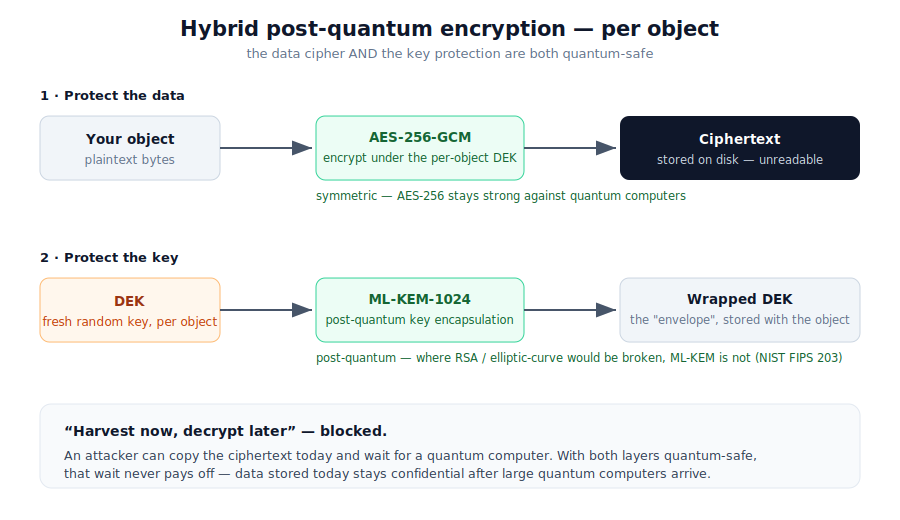

# What is post-quantum encryption, and why KerPlace uses it

A plain-language explainer. No cryptography background assumed. For the precise
threat model and what KerPlace does and does **not** protect, see
[`SECURITY_MODEL.md`](SECURITY_MODEL.md); for definitions, the
[glossary](GLOSSARY.md).

## The short version

> Encryption you trust today can be broken tomorrow by a **quantum computer**.
> Anyone can **copy your encrypted data now and decrypt it later** once those
> machines exist. KerPlace encrypts your data so that *later* never comes:
> the keys are protected with a **post-quantum** algorithm standardized by NIST.

## The problem: "harvest now, decrypt later"

Most of today's secure systems rely on a kind of math (RSA and elliptic-curve
cryptography) to exchange keys safely. That math is hard for normal computers — but
**easy for a sufficiently large quantum computer**, which can run an algorithm
(Shor's) that cracks it. Large enough quantum computers don't exist *yet*, but:

1. They are being built, and serious estimates put capable machines within the
   lifetime of data you are storing today.
2. An adversary doesn't need to wait. They can **record your encrypted data now** —
   from a stolen disk, a leaked backup, a tapped network — and simply **keep it until
   a quantum computer can open it.** This is called **"harvest now, decrypt later."**

So for anything that must stay secret for years — health records, legal documents,
financial data, personal archives, source code, backups — encrypting it with
yesterday's algorithms is already not enough. The clock started the day you stored it.

## What quantum computers break — and what they don't

It's a common misconception that quantum computers break *all* encryption. They don't:

| Used for | Example | Quantum-safe? |
|---|---|---|
| **Key exchange / "asymmetric"** | RSA, elliptic-curve (ECDH/ECDSA) | ❌ **Broken** by Shor's algorithm |
| **Bulk data / "symmetric"** | AES-256 | ✅ **Safe** — only mildly weakened, 256-bit stays strong |

So the weak link is **how the keys are protected and exchanged**, not the cipher that
scrambles the bytes. That's exactly the link KerPlace upgrades.

## The fix: post-quantum cryptography (PQC)

Cryptographers designed new key-exchange algorithms based on math that is hard for
*both* normal and quantum computers (lattice problems). After a multi-year public
competition, **NIST standardized them in August 2024**. The key-transport standard is
**ML-KEM** (FIPS 203, formerly "CRYSTALS-Kyber"). It does one job extremely well:
move a secret key from A to B so that no one in between — classical or quantum — can
recover it.

KerPlace uses the **strongest** parameter set, **ML-KEM-1024**.

## How KerPlace puts it together (hybrid envelope encryption)

KerPlace combines the quantum-safe key transport with a fast, quantum-safe data
cipher. For **every object**:

1. A unique random **data key (DEK)** is created just for that object.
2. The object's bytes are encrypted with **AES-256-GCM** under that DEK — fast,
   hardware-accelerated, and (at 256 bits) quantum-resistant for the data itself.
3. The DEK is protected with **ML-KEM-1024** — the post-quantum step. The protected
   key (an "envelope") is stored next to the ciphertext.

To read the object back you must recover the DEK, which requires the post-quantum
private key — held by KerPlace's key provider, optionally in an **external KMS you
control** (see [off-host custody](OFFHOST_KMS_CUSTODY.md)).

The result: **both** layers — the cipher protecting the data *and* the mechanism
protecting the key — are quantum-resistant. Data harvested today stays unreadable
even after large quantum computers arrive.

## Who actually needs this

You need post-quantum at-rest encryption if your data must remain confidential for
**longer than it will take quantum computers to mature** — which, for most regulated
or sensitive data, is *now*:

- Health, legal, financial and government records with multi-year retention.
- Personal archives, identity documents, private keys and credentials.
- Long-lived backups and anything that would be damaging if revealed years later.

If your data is genuinely throwaway within months, the urgency is lower — but the
cost of being safe by default is essentially zero, which is why KerPlace does it for
every object unless you turn encryption off.

## What this does *not* do

Post-quantum encryption protects **data at rest** against future decryption. It is not
a substitute for the rest of your security: access control, network security, and
keeping the **key custody** safe still matter. KerPlace is honest about its limits —
read [`SECURITY_MODEL.md`](SECURITY_MODEL.md) for exactly what is and isn't covered.

---

*Questions about applying this to your data? Email **support@kerplace.com**.*
