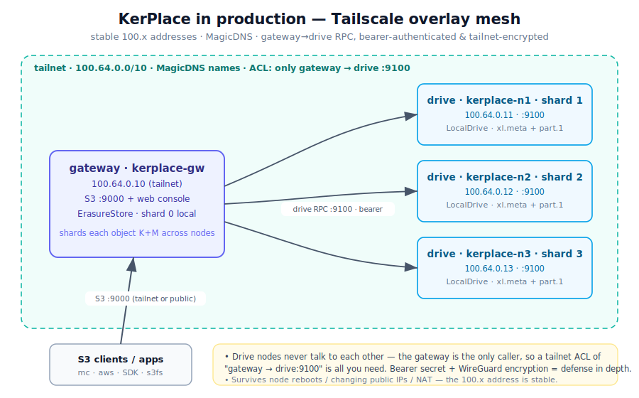

# Production deployment — KerPlace cluster over Tailscale

This is the production runbook for a distributed KerPlace cluster whose nodes live
on different machines / clouds, connected by a **Tailscale** overlay mesh. For
the deployment modes and the erasure model see
[CLUSTERING.md](CLUSTERING.md); this doc is the hardened, boot-persistent setup.



## Why Tailscale (vs the SSH tunnels used for the lab)

The gateway must reach each drive node's RPC port. SSH tunnels are great for a
quick proof, but in production you want:

| | SSH tunnels | **Tailscale overlay** |
|---|---|---|
| Addresses | local forwarded ports, fragile | **stable `100.x` + MagicDNS names** |
| Survives reboots / IP changes / NAT | no (re-establish tunnels) | **yes** (WireGuard, auto-reconnect) |
| Access control | per-tunnel | **tailnet ACLs** (gateway → drive:9100 only) |
| Encryption | SSH | **WireGuard** (+ KerPlace's bearer auth on top) |
| Ops | a tunnel process per link | none — it's just the network |

Because the link is **one-directional** (gateway → drives; drive nodes never
talk to each other), a single ACL rule locks the whole cluster down.

> WireGuard directly (or any other overlay that yields stable per-node IPs)
> works identically — substitute its addresses for the `100.x` ones below.

## 0. Prerequisites

- A KerPlace binary on every node — ship the **static musl build** (`./build-static.sh`)
  so it runs regardless of the node's glibc. See [INSTALL.md](../INSTALL.md).
- A [Tailscale](https://tailscale.com) account and the client installed on each node.
- One shared **cluster secret** (a long random string) for the drive RPC bearer auth:
  ```bash
  openssl rand -hex 32      # generate once; same value on every node
  ```

## 1. Join every node to the tailnet

On each machine (gateway + every drive node):

```bash
curl -fsSL https://tailscale.com/install.sh | sh
sudo tailscale up --hostname kerplace-gw      # or kerplace-n1, kerplace-n2, kerplace-n3
tailscale ip -4                            # note this node's 100.x address
```

For unattended servers, bring them up headlessly with an
[auth key](https://tailscale.com/kb/1085/auth-keys):

```bash
sudo tailscale up --authkey "$TS_AUTHKEY" --hostname kerplace-n1
```

After this, every node can reach every other by MagicDNS name
(`kerplace-n1`, …) or `100.x` address. Confirm: `tailscale status`.

## 2. Lock the tailnet down with an ACL

In the Tailscale admin console (Access Controls), restrict the drive RPC to the
gateway only — drive nodes never need to reach anything:

```jsonc
{
  "tagOwners": { "tag:kerplace-gw": ["autogroup:admin"], "tag:kerplace-drive": ["autogroup:admin"] },
  "acls": [
    // only the gateway may reach a drive node's RPC port
    { "action": "accept", "src": ["tag:kerplace-gw"], "dst": ["tag:kerplace-drive:9100"] }
  ]
}
```

Tag the machines accordingly (`tailscale up --advertise-tags=tag:kerplace-drive`).
This makes the cluster's internal API unreachable from anything but the gateway,
even inside the tailnet.

## 3. Run the drive nodes

On **each** drive node (`kerplace-n1`, `kerplace-n2`, `kerplace-n3`). Bind the RPC to the
tailnet interface so it's never on a public NIC:

```bash
export KP_CLUSTER_SECRET="<the shared secret>"
KP_ROLE=drive \
KP_DRIVE_ADDR="$(tailscale ip -4 | head -1):9100" \
KP_DATA_DIR=/var/lib/kerplace \
./kerplace
```

(The bundled [`cluster-node.sh`](../cluster-node.sh) does the tailnet-IP lookup
and the env wiring for you: `./cluster-node.sh drive`.)

## 4. Run the gateway

On the gateway (`kerplace-gw`, here also hosting shard 0 locally), point
`KP_NODES` at the drive nodes by **MagicDNS name** (stable across reboots):

```bash
export KP_CLUSTER_SECRET="<the shared secret>"
KP_ADDRESS=0.0.0.0:9000 \
KP_CONSOLE_ADDRESS=0.0.0.0:9001 \
KP_DATA_DIR=/var/lib/kerplace \
KP_NODES="0=local,1=kerplace-n1:9100,2=kerplace-n2:9100,3=kerplace-n3:9100" \
KP_NODE_INDEX=0 \
KP_ERASURE_PARITY=2 \
./kerplace
```

`parity 2` → the cluster **survives losing any 2 of the 4 nodes** on reads, needs
a quorum of `≥ K+1 = 3` shards to write, and self-heals returned nodes.

> **Several gateways?** If you run more than one gateway against the same
> cluster, add `KP_CLUSTER_LOCKS=true` on each so writes take a quorum lock
> with **strict fencing** (a superseded gateway is rejected at the data path). A
> single gateway doesn't need it — local locking is always on.

## 5. Make it boot-persistent (systemd)

Generate units with the helper and install them:

```bash
./cluster-node.sh systemd-drive   > /etc/systemd/system/kerplace.service   # on a drive node
./cluster-node.sh systemd-gateway > /etc/systemd/system/kerplace.service   # on the gateway
sudo systemctl daemon-reload && sudo systemctl enable --now kerplace
```

Keep the secret out of the unit file — put `KP_CLUSTER_SECRET=…` in
`/etc/kerplace.env` (mode `600`) and reference it with `EnvironmentFile=`.

## 6. Verify & operate

```bash
mc alias set prod http://kerplace-gw:9000 "$ACCESS" "$SECRET"
mc admin info prod                      # backend type, parity, per-drive online/offline
mc mb prod/data && mc cp ./big prod/data/big   # sharded across the tailnet

# repair after a node was down/replaced
curl -X POST 'http://kerplace-gw:9000/kerplace/admin/v3/heal?bucket=data'
```

| Event | Behaviour |
|---|---|
| a drive node reboots | tailnet reconnects automatically; gateway resumes using it |
| read with ≤ `M` nodes down | reconstructs transparently |
| write with a node down | succeeds if ≥ `K+1` shards land; healed later |
| a returned/replaced node | `heal` rebuilds its shards over the RPC |

## Security checklist

- [ ] `KP_CLUSTER_SECRET` is long, random, identical on all nodes, and stored
      `chmod 600` (never in a committed file).
- [ ] Drive RPC binds the **tailnet** interface (`KP_DRIVE_ADDR=100.x:9100`),
      never `0.0.0.0` on a public NIC.
- [ ] Tailnet ACL allows **only** `gateway → drive:9100`.
- [ ] The gateway's S3 port (`:9000`) is the only thing you expose to clients —
      put TLS in front (`KP_TLS_CERT`/`KP_TLS_KEY`) for public endpoints.
- [ ] Object data is encrypted at rest (post-quantum) per bucket as needed.

The bearer secret and the WireGuard tunnel are **independent** layers — either
alone protects the RPC; together they're defense in depth.
