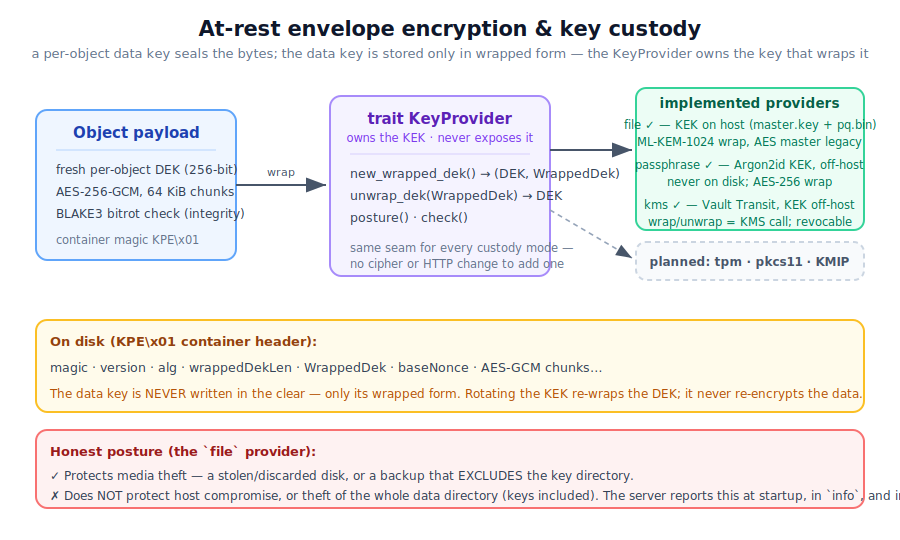

# KerPlace — Security Model

> This document describes, honestly and explicitly, what KerPlace protects, how,
> and — just as importantly — **what it does not protect against today**. It is
> threat-model-first: every security feature is paired with the assumption it
> relies on and the attack it does *not* stop. Nothing here is gated behind a paid
> tier; the security core is auditable in the free product.
>
> **Status legend:** ✅ implemented · 🔶 partial · 🗓️ planned (named block).
> This file grows as each block lands; planned items say so plainly rather than
> implying coverage that does not exist yet.

## 1. Design principles

1. **No security theater.** A feature that does not change the attacker's cost is
   not advertised as protection. Where custody is weak, the server *says so* (at
   startup, in `info`, and in the console) rather than implying strength.
2. **Envelope is an invariant, not an option.** A data key (DEK) is never written
   to disk in the clear — only in wrapped form. This is enforced at the type level
   (`Dek` is not serialisable) and proven by tests.
3. **One small custody seam.** *Where the key that unwraps a DEK comes from* lives
   behind a single trait (`KeyProvider`). Stronger custody modes are additive
   implementations of that trait; they do not touch the cipher or the HTTP layer.
4. **Interoperable, not impersonating.** KerPlace speaks the S3 and `mc admin`
   wire protocols for compatibility, but its on-disk formats, key material, and
   identity are its own.

## 1b. Deployment profiles (`KP_PROFILE`) ✅

A profile is a one-word **posture** that ties the other axes together. It does not
silently flip settings — it declares invariants that are **validated at startup**,
fail-closed.

- **`open`** (default) — today's permissive defaults (dev / trusted network).
- **`sealed`** — the regulated baseline. The server **refuses to start** unless
  *all* of the following hold (a single error lists every unmet one):
  - authentication is enabled,
  - TLS is enabled,
  - at-rest encryption is enabled,
  - the **erasure** backend is in use (not the transparent `fs` mirror),
  - external identity is configured **and the OIDC IdP is reachable** at boot,
  - key custody is **off-host**: `KP_KEY_PROVIDER` is `passphrase` or `kms`, never
    `file`.

This is the point where the custody axis (K0–K3), the identity axis (D1), and
transport/backend choices combine into a posture an operator can assert with one
variable — and that the binary itself enforces rather than trusts. The active
profile is surfaced in the startup banner, `info`, and the console.

## 2. At-rest encryption ✅

When at-rest encryption is enabled (per bucket, or globally via `KP_ENCRYPT`),
each object is sealed with **envelope encryption**:

| Element | Choice |
|---|---|
| Data key (DEK) | Fresh 256-bit key **per object** |
| Bulk cipher | **AES-256-GCM**, 64 KiB chunks, per-chunk nonce `baseNonce(8) ‖ counter(4)` |
| DEK wrapping (default) | **ML-KEM-1024** (post-quantum KEM); the encapsulation shared secret *is* the DEK, the 1568-byte ciphertext is the wrapped form |
| DEK wrapping (legacy decode) | AES-256-GCM under a server master key (`ALG_AES_MASTER`) — still decryptable, never the default for new writes |
| Integrity | AES-GCM auth tag per chunk; **BLAKE3** guards against bitrot at the storage layer |
| Container | `KPE\x01` header: `magic · version · alg · wrappedDekLen · WrappedDek · baseNonce`, then sealed chunks |

**What this protects:** confidentiality and integrity of object *contents* at rest,
including against a future quantum adversary that has harvested ciphertext today
(the ML-KEM-1024 wrap is the post-quantum hedge).

**What it does NOT protect (by itself):**
- **Object metadata** (key names, sizes, timestamps) is not encrypted.
- Encryption is only as strong as **key custody** — see §3. The cipher is moot if
  the attacker can obtain the key that unwraps the DEK.
- It is **not** a substitute for access control (§5) or transport security (§4).

> Rotating the wrapping key **re-wraps the DEK**; it never re-encrypts object data.
> (Key rotation as an operation is a later block, K7.)
>
> **Fail-loud reads.** If the data key cannot be obtained when an encrypted object
> is read (a malformed container, or an unavailable/incorrect key provider — e.g. a
> KMS outage), the read fails with an explicit `500` error **before** any bytes are
> sent. KerPlace never returns a truncated or empty `200` for an object it could
> not decrypt, so a client or replicator cannot mistake "temporarily unreadable"
> for "empty".

## 3. Key custody — the `KeyProvider` model ✅ (`file`) · 🗓️ (others)

> ⚠️ **Choose your provider when initialising a data directory. Changing it later
> is not a runtime switch — it requires re-wrapping every object (block 🗓️ K7).**
> Each provider only reads the objects it wrote: `file` writes/reads `ALG_MLKEM`
> (and legacy `ALG_AES_MASTER`), `passphrase` only `ALG_AES_MASTER` under its KEK,
> `kms` only `ALG_KMS`. A `file` deployment that later wants off-host custody
> (`kms`) cannot just flip the variable — that migration is **K7** (rewrap /
> rotation between providers). Plan custody up front; for a MinIO refugee starting
> on `file`, decide early whether you'll mature to `kms`.

The KEK (key-encryption key) that wraps/unwraps every DEK is owned by a
`KeyProvider`. The provider is chosen at startup with `KP_KEY_PROVIDER`
(default `file`); an unknown value **fails fast** with a clear error rather than
falling back silently.

Every provider must publish an honest **posture**, surfaced in the startup banner,
the admin `info` endpoint, and the console:

| Field | Meaning |
|---|---|
| `unattendedBoot` | Can the server start with no human to supply a factor? |
| `keyOnHost` | Does the unwrap factor live on this machine (vs. an external HSM/KMS)? |
| `protects` | One honest phrase: the custody this posture *does* defeat |
| `doesNotProtect` | One honest phrase: what it explicitly does *not* defeat |

### Providers

| Provider | Status | KEK source | Unattended boot | Key on host | Honest summary |
|---|---|---|---|---|---|
| `file` | ✅ | `master.key` + `pq.bin` in `.kerplace.sys/` | yes | yes | Protects media theft; **not** host compromise or whole-data-dir theft |
| `passphrase` | ✅ | Argon2id over an operator passphrase (never stored) | no | no | Removes the on-host key (protects a full-dir backup too), at the cost of supplying the passphrase at boot |
| `kms` | ✅ | External Vault Transit; unwrap is a network call | yes | no | Custody leaves the host; KMS availability becomes a dependency |
| `tpm` / `pkcs11` | 🗓️ K5/K6 | Hardware-bound key | yes | yes (sealed) | Key cannot be exfiltrated as bytes |

### The `file` provider, stated plainly ✅

`file` is the default and the only provider implemented today. The key material
lives in `.kerplace.sys/` **inside the data directory**. Therefore:

- ✅ It protects against **media theft**: a stolen or discarded disk, or a backup
  that *excludes* the key directory, yields only ciphertext.
- ✗ It does **not** protect against **host compromise** (an attacker with code
  execution on the server can read the key) or against **theft of the whole data
  directory** (a backup or image that includes `.kerplace.sys/` includes the key).

When encryption is on, the server emits this caveat as a **`WARN` at startup** and
reports the same posture in `info` and the console, so an operator can never
mistake `file` for host-independent custody. To remove the on-host key, use the
`passphrase` provider (below) or an external `kms` (🗓️ K3).

### The `passphrase` provider ✅

`KP_KEY_PROVIDER=passphrase` derives the KEK from an operator passphrase
(`KP_KEY_PASSPHRASE`) with **Argon2id** (m = 19 MiB, t = 2, p = 1). The derived key
is **never written to disk** — only a random 16-byte salt (`passphrase.salt`, not
secret) and a sealed verifier (`passphrase.check`) are persisted. On every boot the
KEK is re-derived and must open the verifier; a **wrong or missing passphrase fails
fast** before the server accepts traffic. DEKs are AES-256-GCM-wrapped under the KEK
(`ALG_AES_MASTER`); AES-256 retains post-quantum-acceptable symmetric strength, so
the ML-KEM path is intentionally unused here.

- ✅ Protects **media theft *and* a full data-directory backup** — neither contains
  the key, only ciphertext, the salt, and a verifier.
- ✗ Does **not** protect a **running host compromise** (the derived KEK is in
  process memory) or **disclosure of the passphrase** itself.

**Hardening** (best-effort, applied when this provider is active): core dumps are
disabled (`setrlimit(RLIMIT_CORE, 0)`) and current memory is locked against swap
(`mlockall(MCL_CURRENT)`); the derived KEK and the passphrase buffer are zeroized
after use. `MCL_FUTURE` is deliberately **not** used — this is a data-plane server
that streams large objects, and locking every future allocation would risk OOM. If
locking fails (no `CAP_IPC_LOCK` / low `RLIMIT_MEMLOCK`), the server logs a `WARN`
and continues rather than refusing to start.

> **Provider switching is not a migration path.** Objects written under `file`
> (`ALG_MLKEM`) cannot be read by `passphrase` (it has no ML-KEM key), and vice
> versa. Choose the provider when initialising a data directory. Cross-provider
> migration / key rotation is a later concern (🗓️ K7).

### The `kms` provider ✅

`KP_KEY_PROVIDER=kms` keeps the KEK in an **external KMS** (HashiCorp **Vault
Transit**); the server process never holds it. Each DEK is minted and sealed by
Vault's `transit/datakey` endpoint and unsealed by `transit/decrypt` — so **every
wrap and unwrap is a network round-trip to the KMS**. The wrapped form (`ALG_KMS`)
is the opaque `vault:vN:…` token. This is the one-binary replacement for the
"MinIO + KES" split.

Configuration: `KP_KMS_ENDPOINT` (e.g. `http://vault:8200`), `KP_KMS_KEY` (the
Transit key name), `KP_KMS_TOKEN` (the Vault token; AppRole/Kubernetes auth are
🗓️ later).

- ✅ Protects media theft, a full data-directory backup, **and data at rest the
  moment the KMS revokes the key or token** — even an attacker holding the entire
  data directory cannot decrypt without live KMS access.
- ✗ Does **not** protect a **live host compromise** that can call the KMS with our
  token while the server runs, nor compromise of the **KMS itself**.

**Fail-closed.** At startup the provider does a real datakey → decrypt round-trip
(`check()`); if the KMS is unreachable or the key/token is wrong, **the server
refuses to start**. At runtime, if the KMS is unavailable when an object is read,
the GET returns **`500` with an explicit "key provider error"**, never a silent
empty `200` (see §2 note). Revoking the Transit key or token therefore cuts
decryption immediately and visibly.

> **Performance.** Writes mint a fresh DEK per object (one `datakey` call — keys are
> never reused across objects). Reads are served from a bounded **unwrap-DEK cache**
> (keyed by the wrapped token), so repeated reads of the same object skip the KMS;
> `KP_KMS_CACHE_TTL` seconds (default 300; `0` disables) bounds how long a revoked
> key stays usable for already-read objects. As with the other providers, switching
> to/from `kms` is not a migration path (🗓️ K7); `kms` reads only `ALG_KMS` objects.

> **A concrete, powerful deployment:** run the KMS (a Vault) on a machine *you*
> control — e.g. your laptop — and KerPlace on untrusted hosting, reached over a
> tunnel. A full host compromise then yields only ciphertext + wrapped DEKs; to
> read the data an attacker would also need your KMS, which you can revoke. See
> **[Off-host key custody](OFFHOST_KMS_CUSTODY.md)** for the setup, the guarantee,
> and the honest limit (a *live* host compromise while the KMS is reachable can
> still ride KerPlace's token).

## 4. Transport security 🔶

- **TLS** for the S3 and console listeners is supported (`KP_TLS`, cert/key paths).
  When enabled, all client traffic is encrypted in transit.
- The internal cluster RPC (`/_kerplace/drive/v1/*`) is authenticated with a shared
  **bearer secret** (`KP_CLUSTER_SECRET`) and is expected to run over a private/
  overlay network (e.g. Tailscale — see `PRODUCTION_TAILSCALE.md`).
- **Mutual TLS between gateway and drive nodes ✅** (`KP_CLUSTER_TLS=true`). Each
  node carries one CA-issued cert/key (`KP_CLUSTER_TLS_CERT`/`_KEY`) and the shared
  CA (`KP_CLUSTER_TLS_CA`); the drive **requires** a client certificate that chains
  to the CA and the gateway pins the drive's server cert to the same CA (no system
  roots). So the gateway↔drive RPC is encrypted and **mutually authenticated** — a
  leaked bearer secret alone no longer admits an unauthenticated peer. Without it,
  the transport is bearer-authenticated over a trusted overlay (keep it on a
  trusted segment).

## 5. Authentication & authorization ✅

- **AWS SigV4** request signing (incl. `aws-chunked` streaming) authenticates every
  S3 request; unsigned requests are rejected when auth is enabled.
- **IAM**: multiple users/credentials with canned policies; the admin namespace
  (`/kerplace/admin/v3/*`, with the `/minio/admin/*` compat alias) is classified as
  `Admin` and gated accordingly. `mc admin user …` works over the wire.
- **`MINIO_ROOT_*` credential fallback** is honored for drop-in compatibility, but
  the canonical variables are `KP_ROOT_USER` / `KP_ROOT_PASSWORD`.
- Health endpoints (`/kerplace/health/*`, `/minio/health/*`) bypass auth by design.

### External identity — OIDC ✅ (D1)

When `KP_OIDC_ISSUER` is set, KerPlace federates to an external **OpenID Connect**
IdP (Keycloak, Entra ID, Okta, Auth0, …). ID tokens are validated **RS256 against
the IdP's published JWKS**, with `iss`/`aud`/`exp` (and, for the console flow,
`nonce`) all enforced. A token's group claim maps to a KerPlace policy
(`KP_OIDC_ADMIN_GROUP` → admin, `KP_OIDC_READWRITE_GROUP` → read-write, else
read-only). Two surfaces:

- **Console SSO** (`GET /api/oidc/login` → IdP → `/api/oidc/callback`): the
  authorization-code flow. CSRF/replay is stateless — the login `nonce` is
  HMAC-signed into the OAuth `state`, and the session token is handed to the SPA
  via the URL **fragment** (never sent to servers/logs). Console access requires
  the admin group.
  > **Known limit (honest):** delivering the session token in the URL fragment
  > keeps it out of request lines, server logs and (normally) the `Referer`
  > header, but it **does land in the browser's history**, and some embedding/
  > redirect contexts can still leak a fragment. The token is short-lived (12 h)
  > and re-issuable; for the strictest deployments, run the console on trusted
  > devices and rely on the IdP session lifetime.
- **STS `AssumeRoleWithWebIdentity`** (`POST /`): a programmatic client presents
  its ID token and receives **temporary, auto-expiring** S3 credentials carrying
  the mapped policy. The credentials are **stateless and self-validating**: the
  policy and expiry are HMAC-signed (with the server secret) into the access key,
  and the secret key is `HMAC(server_secret, access_key)`. So any gateway
  re-derives and validates them with **no shared state** — they survive a restart
  and work across multiple stateless gateways — yet nothing is persisted. They
  resolve through SigV4 exactly like any other credential until they expire. This
  is how `mc`/`aws`/SDKs use the IdP.

OIDC is **additive**: it never replaces the built-in IAM (root + static users
still work), and a discovery failure at startup logs a `WARN` and disables SSO
rather than blocking the server. Config: `KP_OIDC_ISSUER` / `KP_OIDC_CLIENT_ID` /
`KP_OIDC_CLIENT_SECRET` / `KP_OIDC_REDIRECT_URL` (+ optional group-mapping vars).

> Config-surface honesty: OIDC tokens are validated, but KerPlace does **not** yet
> support LDAP/Active Directory (🗓️) or service accounts (🗓️ D2). STS credentials
> cannot be revoked before their TTL expires (there is no server-side session
> store to delete from) — keep the TTL short for sensitive roles.

## 6. Threat model summary

| Threat | Status | Notes |
|---|---|---|
| Eavesdropping in transit | ✅ with TLS | Enable `KP_TLS`; off by default |
| Stolen/discarded disk (encrypted) | ✅ | Envelope + `file` custody; exclude keys from the backup |
| Bitrot / silent corruption | ✅ | BLAKE3 per shard + erasure heal |
| Drive loss (durability) | ✅ | Reed-Solomon K+M, replicated metadata |
| Quantum "harvest now, decrypt later" | ✅ | ML-KEM-1024 DEK wrapping |
| Host compromise (code exec on server) | ✗ | The unwrap key is reachable in memory; mitigations = K3 KMS / K5 TPM |
| Theft of the whole data directory | 🔶 | `file`: ✗ (keys travel with the data) · `passphrase` / `kms`: ✅ (key is not on disk) |
| Revoke access to data at rest | ✅ (`kms`) | Revoking the Vault key/token cuts decryption immediately, even for data already exfiltrated |
| Metadata confidentiality | ✗ | Object names/sizes are not encrypted |
| Gateway availability (single S3 plane) | 🔶 | Durability ≠ availability; run several stateless gateways behind an LB — see [MULTI_GATEWAY_HA.md](MULTI_GATEWAY_HA.md) |
| External identity / SSO | ✅ (OIDC) | Console SSO + STS AssumeRoleWithWebIdentity; LDAP still 🗓️ |

## 7. Reporting a vulnerability

Security issues should be reported privately to the maintainers rather than via a
public issue. (A formal `SECURITY.md` disclosure policy and contact is 🗓️ block
S1.) Please include affected version/commit, a reproduction, and the impact you
observed.

---

*This model reflects the code as of the K1 custody-honesty pass. Each subsequent
block (K2 passphrase, K3 KMS, D1 OIDC, S3 mTLS) updates the relevant section and
flips its status marker.*
